# Lab 1: Optitrack Camera Calibration and Communication 

Authors:

Connell Crawford, 

Alexander Debartolo,

Stephen Kwok-Choon

## Introduction 

Optitrack is platform that allows the tracking of defined rigid body objects in a test environment through the use of optical tracking markers. 

The Space Robotics Laboratory (SRL) is equipped with four (4) optical tracking cameras – the Prime^x 13/13W  cameras.

<figure align = "center">
  
 <figcaption align = "center">Figure 1: Prime X 13 Camera.  </figcaption>
  </p>
</figure>

Shown in Figure 1 Each camera has a resolution of up to 1.3 Megapixels, with a 3D tracking accuracy of up to 0.20 mm, rated natively up to 240 Frames Per Second, with a maximum frame rate of 1000 Frames Per Second.

<figure align = "center">
  
 <figcaption align = "center">Figure 2: A representation of the Motive Software tracking a rigid body object. Lines of sight of each camera is shown.  </figcaption>
  </p>
</figure>

Shown in Figure 3 is the room layout and the position of the cameras in the room layout. 

<figure align = "center">
  
 <figcaption align = "center">Figure 3: Room Layout  </figcaption>
  </p>
</figure>

### Room Layout (4- Camera Optitrack Array)

Illustrated here in Figure 4 is the floor plan of the SRL as well as an illustration of the line of sight of each camera.

<p align="center">
  
&nbsp; &nbsp; &nbsp;
  
</p>
<p align = "center">
  <caption> Figure 4: LEFT: Floor Illustration, RIGHT: Camera View Angle </figcaption>
  </p>
</p>

### Wiring Data Connection Diagram

Shown here in Figure 5 is a wiring connection diagram of the cameras, switch, Wi-Fi router as well computer 1 and 2.

<figure align = "center">
  
 <figcaption align = "center">Figure 5: Computer 1 (LEFT) and Computer 2 (RIGHT)  </figcaption>
  </p>
</figure>

Shown here in Figure 6 are the two computers that are connected to the Switch and Optitrack computers. Computer 1 on the left is used to operate Motive software for the Optitrack Camera network.

<figure align = "center">
  
 <figcaption align = "center">Figure 6: Computer 1 (LEFT) and Computer 2 (RIGHT)  </figcaption>
  </p>
</figure>


#### Learning Objectives

<div style="color:black; background:lightblue; border: 1px dashed black">

``` 
1.	Understand how the cameras function and find position

2.	Understand how the Lab Network

3.	Facilitating the use of the Motive Software and Cameras

  a.	Calibrate Cameras

  b.	Create Ridged Bodies

  c.	Broadcast Data from Motive to adjacent software

4.	Detect and display data from Motive in Matlab

5.	Detect and display data from Motive in Simulink

6.	Create 3D simulations in Simulink

7.	Link the data from motive and input into 3D simulink simulation 
``` 
</div>

## 1: Starting Things Up


1.	Set up the space:

    a.	Remove objects blocking the cameras

    b.	During operation and testing, minimize camera line of sight obstructions.

    c.	Remove highly reflective objects and high vis items

2.	Make sure to clear the space of things that block the cameras, and anything that is high visibility or highly reflective as it will add clutter and confusion when operating the cameras.

3.	Turn on both computers, the network switch, and the router.

    a.	The power switches to turn the network switch and router on are behind the computer monitors. 

<figure align = "center">
  
 <figcaption align = "center">Figure 7: Power Strip  </figcaption>
  </p>
</figure>

4.	Log in on both computers 1 and 2 (refer to Figure 6).

5.	On computer 2 (The second lab computer and Student Computer) , open MATLAB Simulink

6.	Turn on the network switch and the router, the switches to turn them on is behind the computer monitors

7.	Wait for the network switch to turn on. This may take a minute or two:

  <p align="center">
    
    &nbsp; &nbsp; &nbsp;
    
  </p>
  <p align = "center">
    <caption> Figure 7: Network Switch (LEFT), WiFi and Local Network Router (RIGHT) </figcaption>
  </p>

    a. This can be seen by looking at the lights on the switch, the first row of lights shows that power is being provided, there should be four lights on this row showing that the 4 cameras are being provided power

    b. On the next row there should be flashing lights, these lights show that communication is happening between the 4 cameras and the left computer and the router, the router will also be connected to the right computer. 

    c.	The cameras will have numbers in the bottom right corner when motive is open and connected to the cameras showing how the software decided to label the cameras, and the cameras will have solid blue or green rings around the lens. (Color of ring – refer to calibration)

8. Open Motive on the 1 Computer 


<figure align = "center">
  
 <figcaption align = "center">Figure 10. Motive Icon  </figcaption>
  </p>
</figure>

    a. The Motive Software should show that four cameras are connected under the Cameras tab.

    b. The cameras may not appear in the same order as listed in figure X.

<figure align = "center">
  
 <figcaption align = "center">Figure 11. Motive Camera Layout  </figcaption>
  </p>
</figure>

<br><!--Paragraph-->
<br><!--Paragraph-->
<br><!--Paragraph-->

## 2: How to Calibrate the Cameras in the Motive Software

<div style="color:black; background:lightblue; border: 1px dashed black">

``` 
Objectives:
 
1. Completing Calibration of Cameras
2. Obtain a Calibration of “Exceptional” or as good as possible.
3. Set the Global XYZ reference Frame.
4. Get screenshots and pictures for lab report

``` 
</div>

### 2.1 Optitrack Camera Calibration

1.	To calibrate the cameras, you will need the calibration wand and calibratio n square

<figure align = "center">
  
 <figcaption align = "center">Figure 12. Calibration Wand and Calibration Square  </figcaption>
  </p>
</figure>

2. To reset the layout of Motive, go to the menu bar at the top left and click on the Layout button then click on the Calibration button as shown in figure 13.

<figure align = "center">
  
 <figcaption align = "center">Figure 13. Calibration Layout  </figcaption>
  </p>
</figure>

3.	To start the calibration of the cameras, go to the calibration tab in Motive and select New Calibration.

<figure align = "center">
  
 <figcaption align = "center">Figure 14. New Calibration  </figcaption>
  </p>
</figure>

4.	To Calibrate: Wave the Calibration Wand at a slow to moderate speed around the simulation volume. As best as you can try not to block the cameras. 

    REMINDER: Also try to not to bump into the camera poles or tables as the vibrations will propagate   to the cameras. 

    a. If you look at the cameras you can see the rings on the camera will start off blue but will turn green as they become calibrated. The blue and green lights are directional and will help you determine what areas need further wanding.

    b.	You can also look at the Motive software and see on the left side how calibrated as the LED ring around each camera turns from blue to green. You want the cameras to reach the dark green. The sections of LED that are blue indicate the quadrant of the camera vision that still needs another pass with the wand and further calibration.

    c.	You can also see in the camera view what areas have been wand-ed and areas that still need more wanding.

<figure align = "center">
  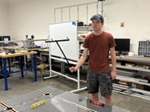
 <figcaption align = "center">Figure 15. Example Student Wanding  </figcaption>
  </p>
</figure>

<figure align = "center">
  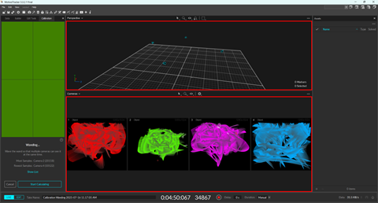
 <figcaption align = "center">Figure 16. Motive Software During Wanding  </figcaption>
  </p>
</figure>

5.	Once the wanding has been captured you will then need to put the wand away and hit the Start Calculating button.  The computer will then do the calculate the calibration of the sim  space and determine the location of the cameras relative to each other.

<figure align = "center">
  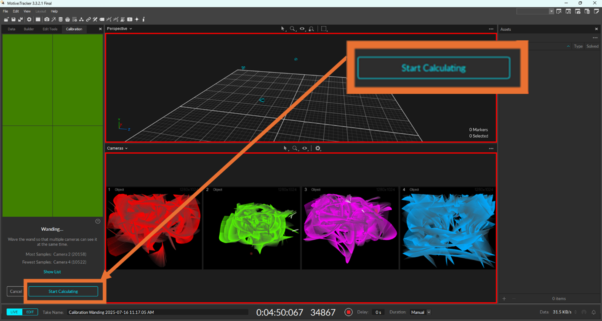
 <figcaption align = "center">Figure 17. Start Calibration Button  </figcaption>
  </p>
</figure>

6.	After wanding is completed and “start calculating” is pressed. The Optitrack software will determine the accuracy and coverage in the designated space. The software will provide feedback.  Need to get “Exceptional”

<figure align = "center">
  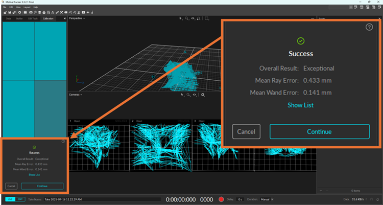
 <figcaption align = "center">Figure 18. Calibration Output  </figcaption>
  </p>
</figure>

### 2.2 Setting the Global XYZ Origin

This step is necessary in order to set the Global XYZ reference frame. 

1.	Position the ground plane aligned to the corner of the sim-space. Setting the ground plane to determine the Global XYZ reference frame (See Fig. X).

<figure align = "center">
  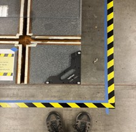
 <figcaption align = "center">Figure 19. Calibration Square Zero  </figcaption>
</figure>

2.	You then can select set ground  level on the Motive software - Make sure drop down is on auto

<figure align = "center">
  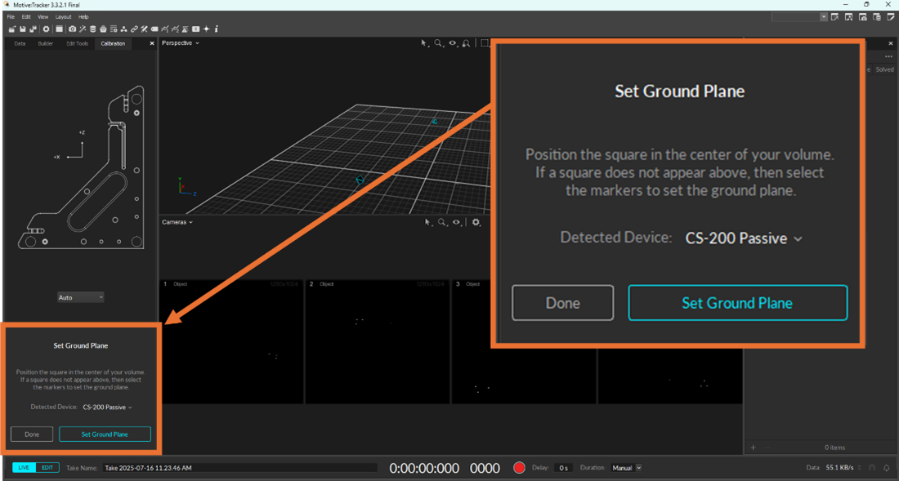
 <figcaption align = "center">Figure 20. Ground Plane for Motive  </figcaption>
  </p>
</figure>

3.	<span style="color:blue">Success!</span>. The cameras are now calibrated. Upon completion, the position of the cameras and the location of the XYZ Global Origin plane are shown within the motive virtual display as shown in Fig X. 


<figure align = "center">
  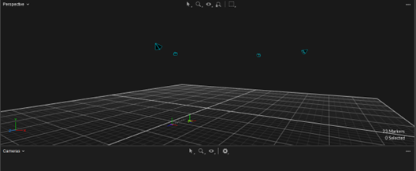
 <figcaption align = "center">Figure 21. Layout of the camera physical location as well as the ground plane are shown within the Motive Software  </figcaption>
  </p>
</figure>

**Make sure to complete all these objectives before proceeding:**


**Summary of Objectives:**

<div style="color:black; background:lightblue; border: 1px dashed black">

```

1. Completing Calibration of Cameras
2. Obtain a Calibration of “Exceptional” or as good as possible.
3. Set the Global XYZ reference Frame.
4. Get screenshots and pictures for lab report
 
```
</div>

<br><!--Paragraph-->
<br><!--Paragraph-->
<br><!--Paragraph-->

## 3: Setting Up Motive to Track Objects and Broadcast Data

<div style="color:black; background:lightblue; border: 1px dashed black">

```
Objectives:

1. Make a Ridged body in Motive
2. In Motive get the position and rotation graphs for your Ridged Body
3. Set up and Turn on Broadcast 
4. Get screenshots for lab report

```
</div>

### 3.1 Create Rigid Body
1.	To reset the layout of Motive on Computer 1, go to the menu bar at the  top left and click on the Layout button then click on the Calibration   button as shown in figure X to reset the layout to a default orientation and information

<figure align = "center">
  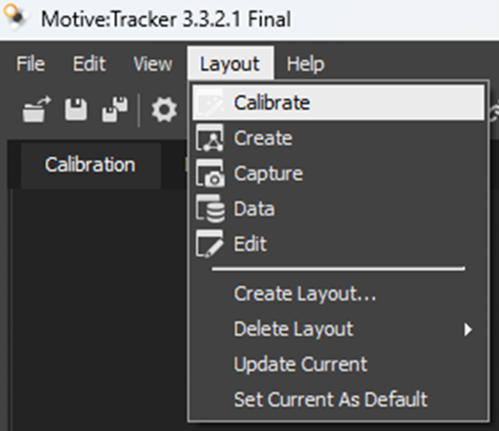
 <figcaption align = "center">Figure 22. Calibration Layout  </figcaption>
  </p>
</figure>

<figure align = "center">
  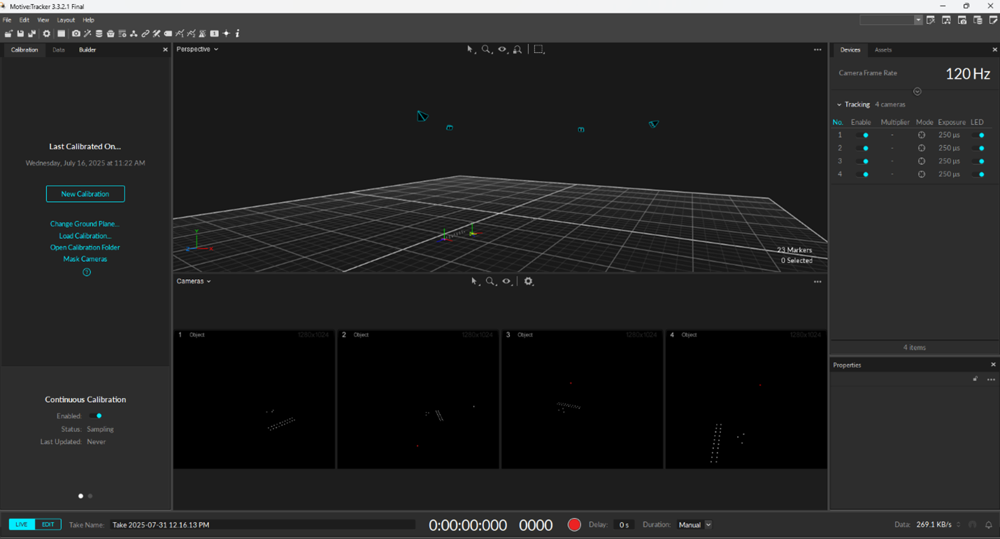
 <figcaption align = "center">Figure 23. Standard layout of the Motive Software if the ”Layout > Calibrate” button is pressed. </figcaption>
  </p>
</figure>

2.	Recall From Earlier: Motive recreates the simulation space virtually, which is shown in the top middle of the screen. 

  - Use the scroll wheel to the virtual camera to zoom in and out. 
  - Hold down the middle mouse button (push down the scroll wheel) and move the mouse to translate the virtual camera.
  - Hold down right click and move the mouse to rotate the virtual camera.

<figure align = "center">
  
 <figcaption align = "center">Figure 24. Motive Virtual Space </figcaption>
  </p>
</figure>

3.	Below the virtual space, the cameras that are connected are shown and what they are seeing (By default, they are in object view, showing you what markers the cameras see).

<figure align = "center">
  
 <figcaption align = "center">Figure 25. Optitrack Camera Layout </figcaption>
  </p>
</figure>

  1.	If you click on one of the cameras it will:

  - Highlight the markers it sees (object view)
  - In the virtual space draw lines from the camera to the markers it sees
  - On the physical camera you selected will have a green ring around the lens. (The other cameras will have a blue ring)

4.	To build a “Rigid Body” which is an object that Motive will track, go to View>Builder. Also go to View>Assets

<figure align = "center">
  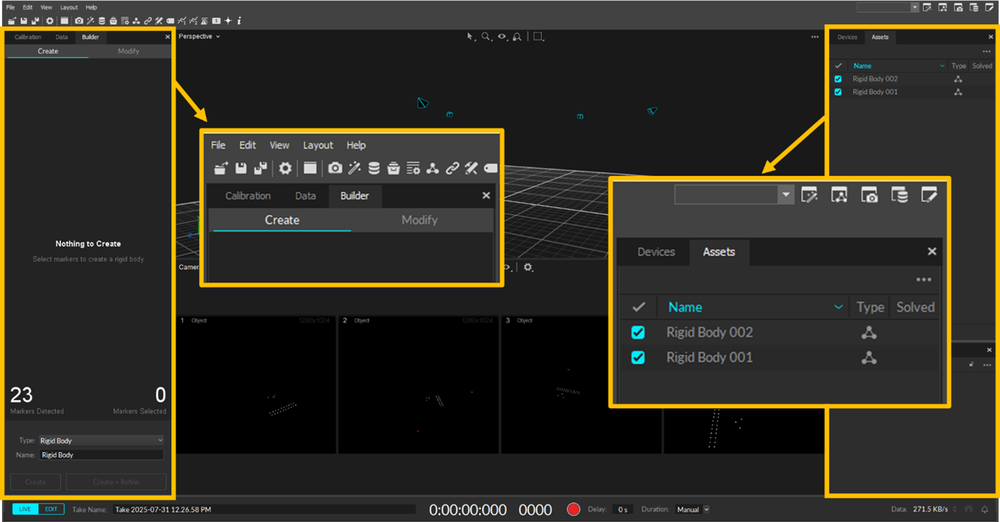
 <figcaption align = "center">Figure 26. Building Rigid Body in Motive </figcaption>
  </p>
</figure>

5.	If there are any rigid bodies in the Assets tab, click on them and delete them .
6.	In the virtual space bring the markers of your rigid body into view.

  a.	You can use Zoom to All to see all the markers in the virtual space by:

    i.	Right clicking anywhere in the virtual space and select Zoom to All 

    ii.	Holding Shift and pressing F

  b.	NOTE: need at least three markers to uniquely identify each rigid body. The position and placement of the rigid body markers per object has to be unique. To allow the software to ID each rigid body.

<figure align = "center">
  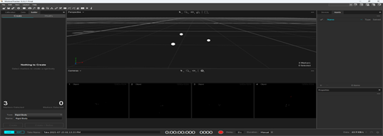
 <figcaption align = "center">Figure 27. Rigid Body Markers in Optitrack</figcaption>
  </p>
</figure>


7.	Select the markers that make up your rigid body in the virtual space.  You can select markers by:
  - Holding left click and dragging to create a selection box to select the markers. 
  - Holding control and selecting each marker.

<figure align = "center">
  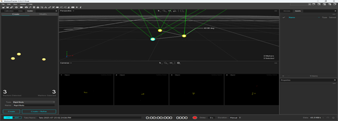
 <figcaption align = "center">Figure 28. Selecting Rigid Body Markers</figcaption>
  </p>
</figure>

8.	Once the markers that make up your rigid body are selected, click Create in the Builder window. 
9. In the virtual space you will now see that the markers you selected have been turned into the representation of your rigid body. 

    - You will see there is now a diamond in-between your markers, which is where Motive is estimating is the center of your Rigid Body.

    - You will also see lines that connect the markers together and dashed lines that show how the rigid body is formed and tracked.
    
    - You will also see that the rigid body is all the same color showing that it is one object.

<figure align = "center">
  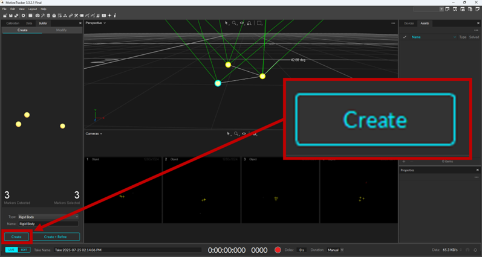
 <figcaption align = "center">Figure 29. Create Rigid Body Object</figcaption>
  </p>
</figure>

<figure align = "center">
  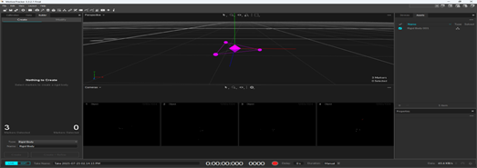
 <figcaption align = "center">Figure 30. Rigid Body Object</figcaption>
  </p>
</figure>

9.	To see the data that Motive is collecting, click ONLY the center diamond by left clicking on it.  Or click on the rigid body through the assets tab.
10.	Go to View > Graph1, this will show you the X,Y,Z positions of the diamond.

    a.	You can drag the edge of the window to see it better 

    b.	If you are tracking a mobile object such as a the rigid body cardboard box in the lab. A team member can pick up the cardboard box and move it around to show that it is being tracked by the optitrack software.

<figure align = "center">
  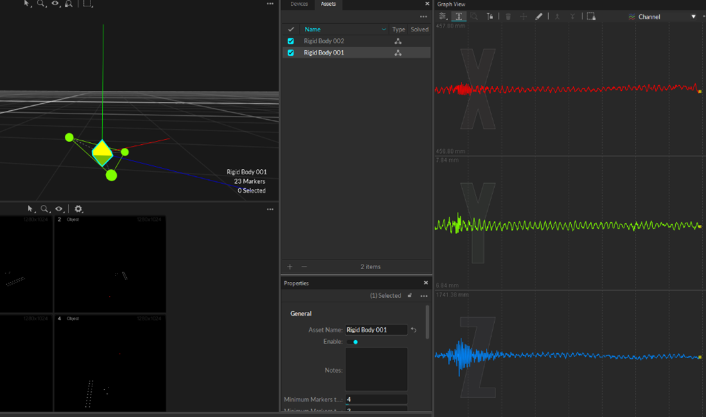
 <figcaption align = "center">Figure 30. Graphs of [X Y Z] Position of the Rigid Body</figcaption>
  </p>
</figure>

11.	To show rotation: 

    11.1 Click on the graph you want to change (X, Y, or Z).

    11.2 Across the top of the graph window there are several options.  Open the option on the farthest left, it will give you a checkbox window of graphing options. 

      - Leave the Markers section alone as it is for labeling the graphs (the background letters of X, Y, and Z).

    11.3 In the Rigid Body/Bone section uncheck X, Y, Z and check RotX, RotY, and/or RotZ to show rotation instead of position respectively.

<figure align = "center">
  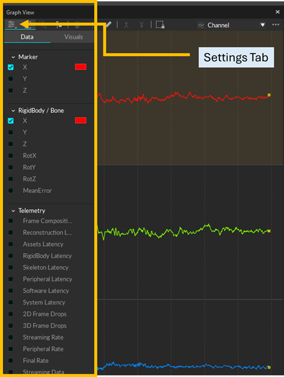
 <figcaption align = "center">Figure 31. Selecting options to display [ RotX, RotY, RotZ ] Rotation of the rigid body instead of Position [x , y, z] of the rigid body.</figcaption>
  </p>
</figure>


<figure align = "center">
  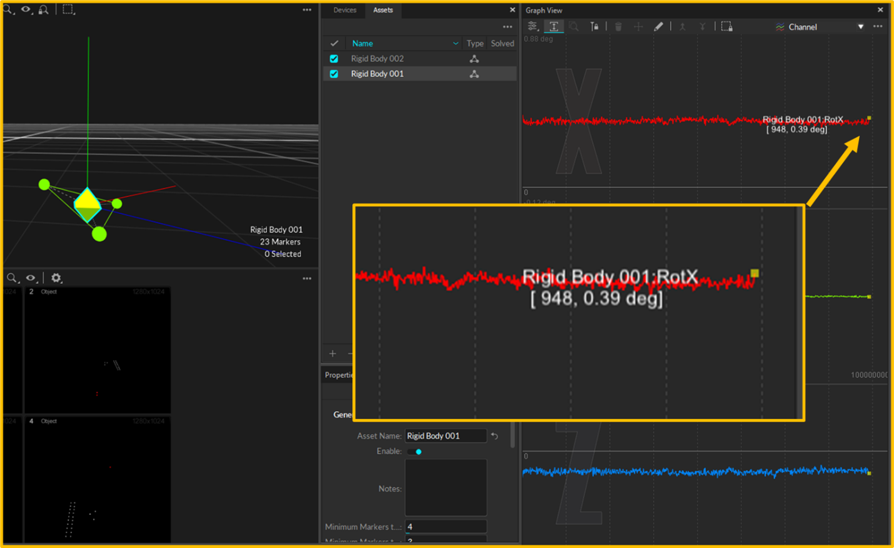
 <figcaption align = "center">Figure 31. Showing the graph of rotation information in motive.</figcaption>
  </p>
</figure>


### 3.2 Setup broadcasting / Stream of Rigid Body Data 

1.	To start broadcasting, go to Edit > Settings

<figure align = "center">
  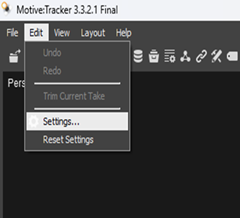
 <figcaption align = "center">Figure 32. Select Settings Tab.</figcaption>
  </p>
</figure>

2.	Go to the Streaming Tab
3.	Ensure that the following setting are enabled:

<figure align = "center">
  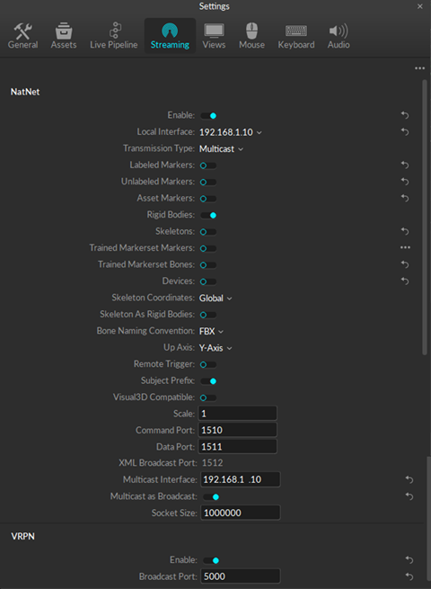
 <figcaption align = "center">Figure 33. Broadcast Settings</figcaption>
  </p>
</figure>

4.	You may need to turn enable broadcasting off and on to get the settings to be set.

    NOTE: Only these ports for streaming are available: 1510, 1511, 1512, 5000, 9910, and 27000.

<br><!--Paragraph-->
<br><!--Paragraph-->
<br><!--Paragraph-->

## 4: Getting Data from the Motive Software into Matlab: 

#### Learning Objectives
<div style="color:black; background:lightblue; border: 1px dashed black">

```
1. Download Optitrack MATLAB Plugin 1.1.0 (Current Version) 

2. Connect to SRL Wi-Fi Router with IP settings 

3. Obtain your computer Wi-Fi  IP address 

4. Extract the Matlab Plugin and change the appropriate IP address settings 

5. Run the Matlab script - OptiSample_RigidBodyGraph.m 

6. Demonstrate that sample data is streaming to your Laptop. 

7. Document all steps in your team lab report. 
```
</div>

 

## 4.1 - Downloading Optitrack MATLAB Plugin 1.1.0 

1. Create a folder called OptiTrack for organizing files related to this lab.  

2. First download MATLAB Plugin 1.1.0, (the version may be different) which includes software that is able to receive data from Motive. 
    *  Go to https://optitrack.com/support/downloads/plugins.html or go to https://optitrack.com/ and click on support>downloads>plugins 
    * Scroll down this page until you see MATLAB Plugin 1.1.0 and download the software. 
    * NOTE: Make sure you are connected to the school Wi-fi network to have internet access. 
<!--Picture 1-->
<figure align = "center">
  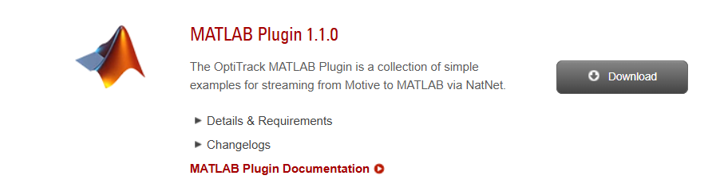
 <figcaption align = "center">Figure X: MATLAB Plugin for Connecting to Motive      </figcaption>
  </p>
</figure> 

3. Once the download is complete, move OptiTrack_MATLAB_Plugin_1.1.0.zip to the folder OptiTrack. 

4. Extract/Unzip OptiTrack_MATLAB_Plugin_1.1.0.zip 
<!--Picture 1-->
<figure align = "center">
  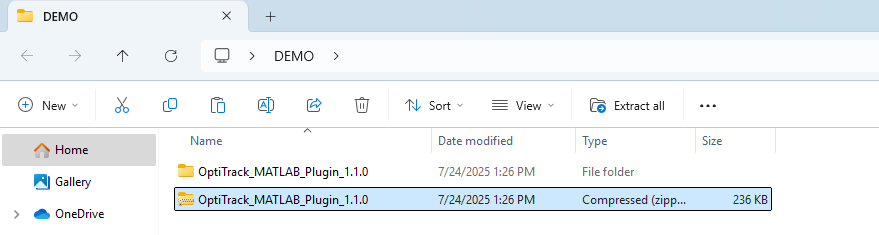
 <figcaption align = "center">Figure X: Unzipped the OptiTrack_MATLAB_Plugin_1.1.0.zip Folder      </figcaption>
  </p>
</figure>

5. Open the unzipped OptiTrack_MATLAB_Plugin_1.1.0, then open the Matlab folder 
    * Inside you will find some examples of Matlab scripts that are able to capture data from Motive. 
<!--Picture 1-->
<figure align = "center">
  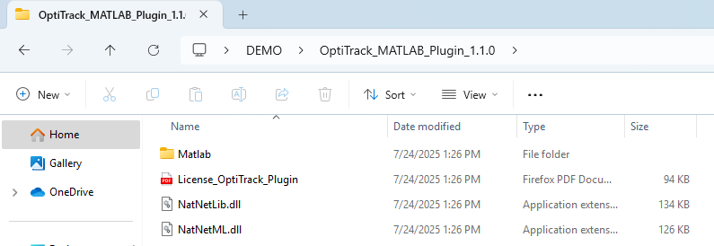
 <figcaption align = "center">Figure X: Opening the Unzipped OptiTrack_MATLAB_Plugin_1.1.0.zip folder      </figcaption>
  </p>
</figure>
<!--Picture 2-->
<figure align = "center">
  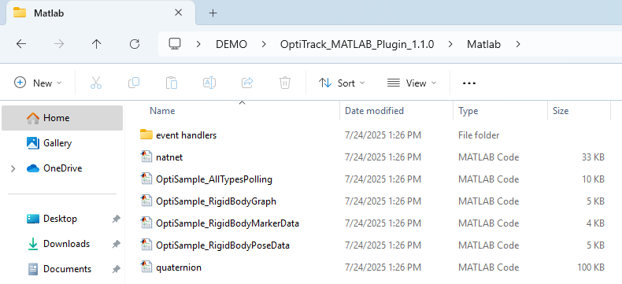
 <figcaption align = "center">Figure X: Opening the Matlab Folder      </figcaption>
  </p>
</figure>

6. Open the natnet.m and OptiSample_RigidBodyGraph.m scripts in MATLAB. These scripts take the position and rotational data from Motive and displays it as a graph.   
<!--Picture 1-->
<figure align = "center">
  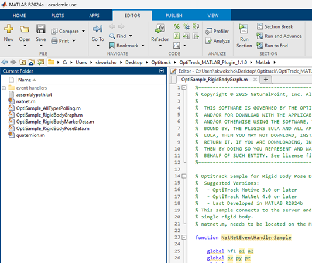
 <figcaption align = "center">Figure X: Showing the OptiTrack_MATLAB_Plugin_1.1.0.m opened in Matlab      </figcaption>
  </p>
</figure>

## 4.2 - Connecting to the Space Robotics Wi-Fi Router 

1. Connect to the Wi-Fi Router SPACE_ROBOTICS_LAB. The professor will give you the password. 
    * NOTE: When connecting to the Wi-Fi router you need to connect with a fixed IP address. The Wi-Fi Router is assigned as 192.168.1.12.  Subnet mask 255.255.255.0 
    * Your Wi-Fi setting in your computer should assign itself a number to the same path 192.168.1.X, with X a number assigned between 0 and 255. 
    * NOTE: This network is not connected to the internet.  
    * Do not set to auto connect. 

2. Open Command Prompt. You can use the windows search to find it. 

3. Type ipconfig into command prompt. You are looking the Default Gateway with the IP address of 192.168.1.12. Two lines above is the IPv4 address of the computer you are on.  
<!--Picture 1-->
<figure align = "center">
  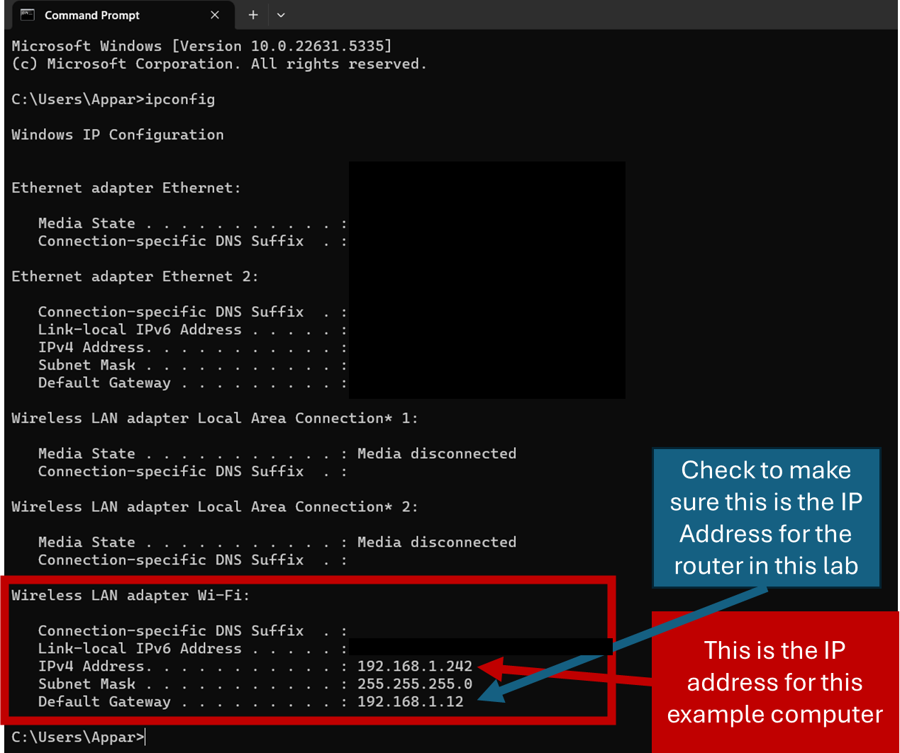
 <figcaption align = "center">Figure X: Finding the IP address for your computer      </figcaption>
  </p>
</figure>

4. Make sure that Motive is set to Streaming and the tabs for streaming are turned on. 
<!--Picture 1-->
<figure align = "center">
  
 <figcaption align = "center">Figure X: Streaming in Motive software is turned on.      </figcaption>
  </p>
</figure>

### 4.3 - Setting Up MATLAB to receive data from Motive 
1. In MATLAB go into the natnet.m file and change the IP addresses. 
    * Your computer is the client and is the IP address we found in step 4.2.3 
    * The Motive computer is the host and is 192.168.1.10 
<!--Picture 1-->
<figure align = "center">
  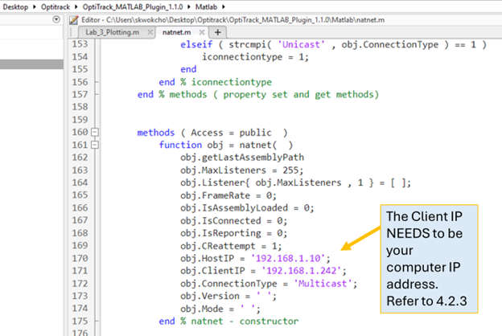
 <figcaption align = "center">Figure X: Setting the Host and Client IP address in Matlab on YOUR computer.      </figcaption>
  </p>
</figure>

2. In MATLAB go into the OptiSample_RigidBodyGraph.m file and change the IP addresses. 
    * Your computer is the client and is the IP address we found in step 4.2.3 
    * The Motive computer is the host and is 192.168.1.10 
<!--Picture 1-->
<figure align = "center">
  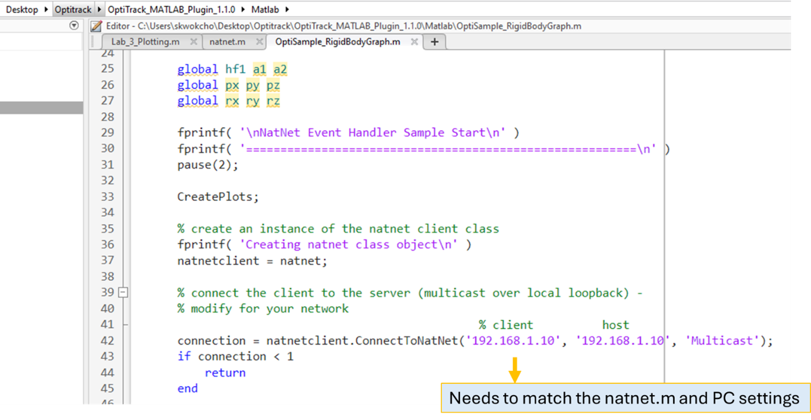
 <figcaption align = "center">Figure X: Matlab script IP address settings.      </figcaption>
  </p>
</figure>

3. Run the OptiSample_RigidBodyGraph.m script.  
<!--Picture 1-->
<figure align = "center">
  
 <figcaption align = "center">Figure X: Matlab Run script button 😊      </figcaption>
  </p>
</figure>

 
4. The first time you run this script you will have to tell MATLAB about where the library for connecting MATLAB to MOTIVE is. You will find the library by going up one folder and selecting NatNetML.dll 
<!--Picture 1-->
<figure align = "center">
  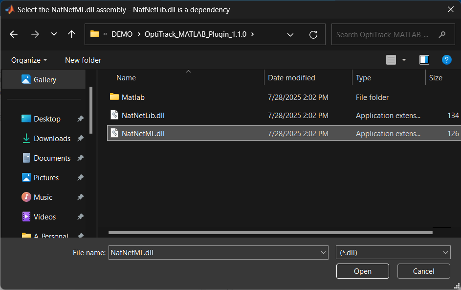
 <figcaption align = "center">Figure X: Selecting The Library for MOTIVE to MATLAB Communication      </figcaption>
  </p>
</figure>

5. Upon successful connection Matlab will obtain telemetry data from Motive both posted in the command window as well as graphed in Figure 1. The Frame number should be increasing with progression in time. 
<!--Picture 1-->
<figure align = "center">
  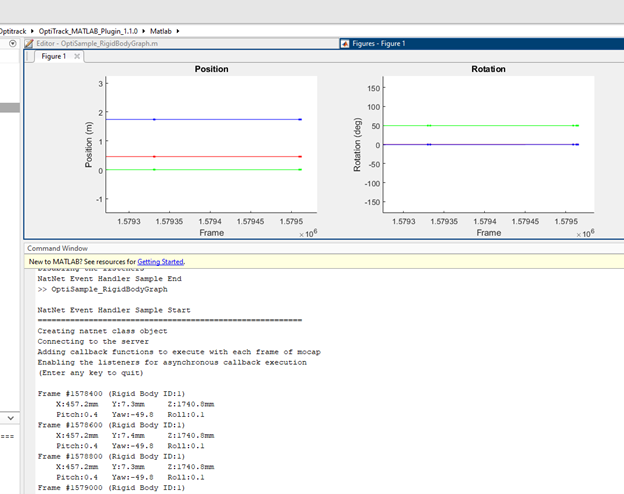
 <figcaption align = "center">Figure X: MATLAB Receiving Telemetry Data from Motive      </figcaption>
  </p>
</figure>

NOTE: Reconnect to the School Network to resume internet access. 

#### Learning Objectives
<div style="color:black; background:lightblue; border: 1px dashed black">

```
1. Download Optitrack MATLAB Plugin 1.1.0 (Current Version) 

2. Connect to SRL Wi-Fi Router with IP settings 

3. Obtain your computer Wi-Fi  IP address 

4. Extract the Matlab Plugin and change the appropriate IP address settings 

5. Run the Matlab script - OptiSample_RigidBodyGraph.m 

6. Demonstrate that sample data is streaming to your Laptop. 

7. Document all steps in your team lab report. 
```
</div>

<br><!--Paragraph-->
<br><!--Paragraph-->
<br><!--Paragraph-->

## 5: Getting Data from the Motive Software into Matlab Simulink 

#### Learning Objectives
<div style="color:black; background:lightblue; border: 1px dashed black">

```
1. Download NatNet SDK on Computer 1

2. Download udp_c_comm_matlab_simulink.zip on Computer 1 

3. Validate and verify correct settings in the FuncMotive function on Computer 1 

4. Update Simulink Sim on Computer 1 

5. Create UDP Send in Simulink Sim using Instrument Control Tool Box 

6. Receive Optitrack Data from Motive to Simulink on Computer 1 

7. Broadcast Optitrack Data from Simulink on Computer 1 

8. Create Simulink Model on your Computer with UDP Receive function. 

9. Receive Optitrack data in Simulink on your Computer. 

10. Document and report on all steps as outlined. 
```
</div>

### 5.1 How to get receive Motive data in Simulink using FuncMotive.m on Computer 1 Only. 

1. First download NatNet SDK, which are software libraries and functions that can receive the data from Motive. 

    * Go to https://optitrack.com/support/downloads/developer-tools.html#natnet-sdk or go to https://optitrack.com/ and click on the software tab, then scroll down to NatNet SDK and click learn more, then click download the NatNet SDK.  

    * NOTE: Make sure you are connected to the school Wi-fi network to have internet access. 

    * On this page, you can click on the download link. https://optitrack.com/support/downloads/developer-tools.html  

    * NOTE: the version of NatNet_SDK may be different at the time of downloading of the SDK. 

<figure align = "center">
  
 <figcaption align = "center">Figure 1. Download NatNetSDK into a folder in your workspace:  Optitrack >  Downloads > Developer Tools > NatNetSDK.  </figcaption>
  </p>
</figure>


2. Download udp_c_comm_matlab_simulink.zip from Canvas (Provided by the instructor of the lab). 

3. Once the downloads are complete, move NatNet_SDK_4.3.zip and udp_c_comm_matlab_simulink.zip to the same folder -  Optitract folder.
    * NOTE: the version of NatNet_SDK may be different at the time of downloading of the SDK. So, you may see numbers other than 4.3. 

4. Make the OptiTrack folder for Computer 1. 

5. Extract/Unzip NatNet_SDK_4.3.zip and udp_c_comm_matlab_simulink.zip each zip file respectively into the OptiTrack folder.  

6. Verify you have these MATLAB Addons  
    * Instrument Control Toolbox Addon 
    * Aerospace Blockset Addon 
    * Simulink Desktop Real-Time Blockset Addon 
<!--Picture 1-->
<figure align = "center">
  
 <figcaption align = "center">Figure 1. Instrument Control Toolbox Addon.  </figcaption>
  </p>
</figure>
<!--Picture 2-->
<figure align = "center">
  
 <figcaption align = "center">Figure 1. Aerospace Blockset Addon.  </figcaption>
  </p>
</figure>
<!--Picture 3-->
<figure align = "center">
  
 <figcaption align = "center">Figure 1. Simulink Desktop Real-Time Blockset Addon.  </figcaption>
  </p>
</figure>

7. Reconnect to the Router:  SPACE_ROBOTICS_LAB 
8. In MATLAB, open the Funcmotive.m file in the udp_c_comm_matlab_simulink folder.
<figure align = "center">
  
 <figcaption align = "center">Figure 1. This is what you should see when you open the FuncMotive.m file in Matlab.   </figcaption>
  </p>
</figure>

9. Scroll down the file until you find the line of code that is trying to point to the NatNet_SDK_X. Find this line (Line 98): dllpath = fullfile(...
<figure align = "center">
  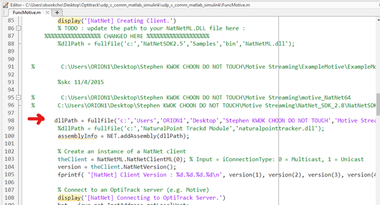
 <figcaption align = "center">Figure 1. Need to update the dllPath.    </figcaption>
  </p>
</figure>

    * In the version that you have unzipped it is: 
    * dllPath = fullfile('c:','Users','ORION1','Desktop','Stephen KWOK CHOON DO NOT TOUCH','Motive Streaming','NatNet_SDK_2.8','NatNetSDK','lib','x64','NatNetML.dll'); 
    * The dllPath has to point to the NatNetML.dll file located inside the NatNet_SDK_X.X developer folder that you have downloaded. 


10. Open the NatNet_SDK_4.3 folder and go down the path > NatNetSDK > lib > x64 

    * NOTE: the version of NatNet_SDK may be different at the time of downloading of the SDK. 

    * Your path may look like this: C:\Users\skwokcho\Desktop\Optitrack\NatNet_SDK_4.3\NatNetSDK\lib\x64

11. Copy the path at the top of the folder.  
<figure align = "center">
  
 <figcaption align = "center">Figure 1. Showing two different ways to find the file path for the NatNetML.dll file.     </figcaption>
  </p>
</figure>

12. Paste the path in the FuncMotive.m script, above the dllPath line of code (see figure X in step 7 and 11.). And make sure to comment out the path as shown. 

13. Change the existing dllPath path to the path that was pasted above and point to NatNetML.dll, Refer to figure X. 
<figure align = "center">
  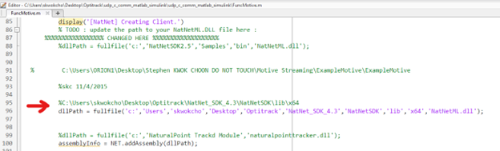
 <figcaption align = "center">Figure X: Showing the updated dllPath in the FuncMotive.m file.      </figcaption>
  </p>
</figure>

14. Make sure the Matlab workspace file path points back to the FuncMotive.m folder 
<figure align = "center">
  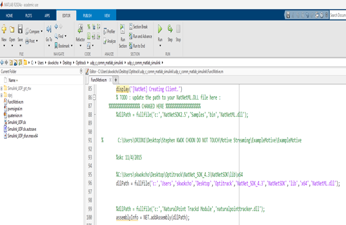
 <figcaption align = "center">Figure X: Matlab Pointing to the correct folder that contains the FuncMotive.m file.       </figcaption>
  </p>
</figure>

15. Change the IP address in Funcmotive.m to the IP Address of the computer running Motive. This is because the Motive software is broadcasting on Computer 1 on the IP address of “192.168.1.10” 
<figure align = "center">
  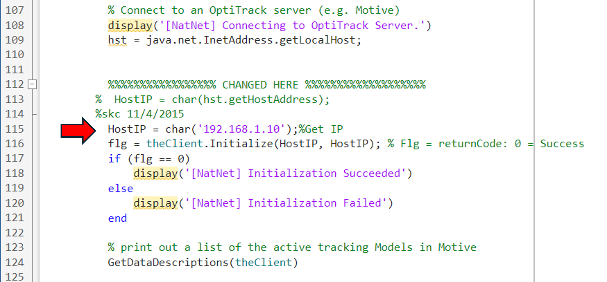
 <figcaption align = "center">Figure X: Changing IP address of the Host in FuncMotive.m      </figcaption>
  </p>
</figure>

16. Then open Simulink_UDP.slx in MATLAB Simulink.
    * NOTE: This Simulink template contains example segments of code that are not currently necessary but can be implemented later for control of a vehicle. We are going to edit and comment out parts of the Simulink model that are not needed at this moment in time. 
<figure align = "center">
  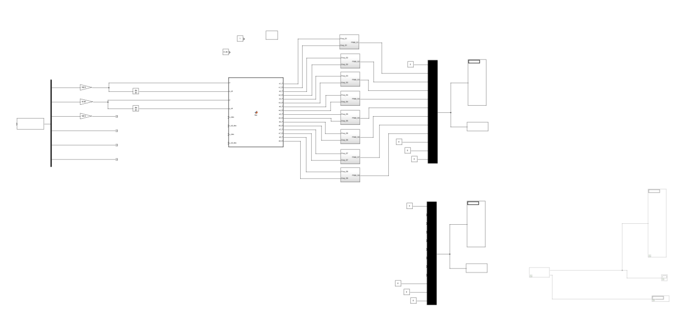
 <figcaption align = "center">Figure X: Simulink Block diagram of Simulink_UPD.slx file.       </figcaption>
  </p>
</figure>

17. Close the Scope window if it is in your way 

18. To move around in Simulink, you can zoom in and out using the scroll wheel. You can also hold the middle mouse button and move the mouse to move around the workspace 
    * You can click and drag the boxes and lines around to connect and organize them.  

19. Comment out all the control blocks after and including the big Matlab Block named “Solenoid Mapping Function” by holding left clicking off to the side and drawing a big selection box. Then right click on the Matlab Block and select Comment Out. 
<figure align = "center">
  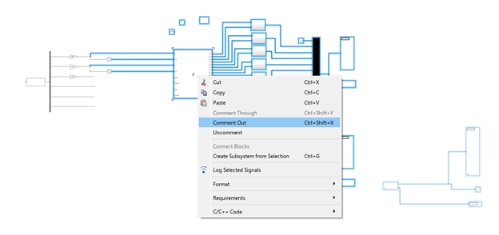
 <figcaption align = "center">Figure X: Commenting Out Control Logic     </figcaption>
  </p>
</figure>

20. Disconnect the lines to the commented-out code by clicking and dragging the end of the arrows. 
<figure align = "center">
  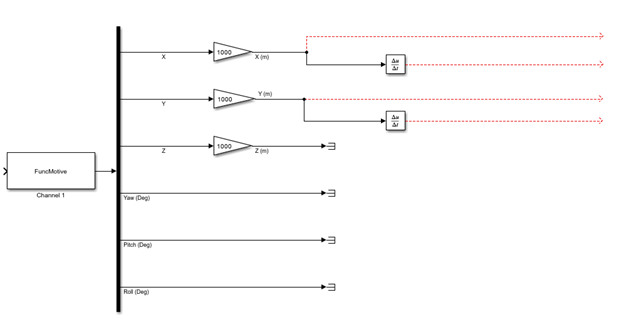
 <figcaption align = "center">Figure X: Disconnecting the Lines     </figcaption>
  </p>
</figure>

21. Go to the right end of the control section and copy the black box(mux) and text box(display). 
<figure align = "center">
  
 <figcaption align = "center">Figure 1. Copying Mux and Display Blocks    </figcaption>
  </p>
</figure>

22. Paste it next to the lines you disconnected earlier and “uncomment” the mux and display to activate them. You may need to move the previously commented blocks to the left to make some space.  
<figure align = "center">
  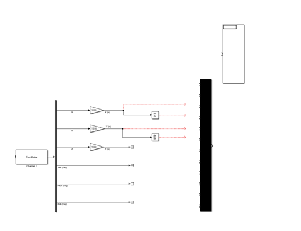
 <figcaption align = "center">Figure X: Uncommenting The Mux and Display Blocks     </figcaption>
  </p>
</figure>

23. Change the mux so that it has 6 inputs. You can change the settings of a block by double clicking on it.  
    * NOTE: If you are tracking 2,3, ... X rigid body objects this needs to be adjusted accordingly. Each rigid body object provides Position [X,Y,Z] and Orientation [Theta, Psi, Phi] OR Quaternion [Qw,Qx,Qy,Qz] - Refer to the FuncMotive.m file for customization – Or ask the instructor :)  
<figure align = "center">
  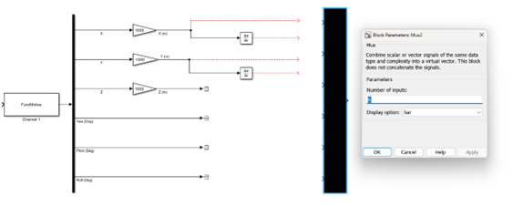
 <figcaption align = "center">Figure X: Changing Size of Mux.     </figcaption>
  </p>
</figure>

24. Connect X, Y, Z, Yaw, Pitch, and Roll to the Mux (black box). You will need to delete the terminates on the Z and angle values. Also delete the d/dt, derivative blocks. You can also add a scope to any of the channels.  
<figure align = "center">
  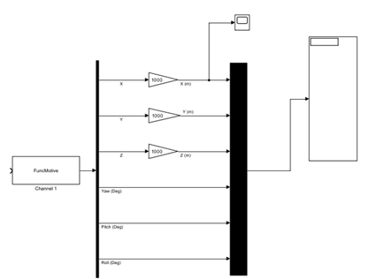
 <figcaption align = "center">Figure X: Simulink with Display and Scope Connected     </figcaption>
  </p>
</figure>

25. Verify Motive has the correct broadcast settings. 
<figure align = "center">
  
 <figcaption align = "center">Figure 1. Verify Motive Broadcast Settings    </figcaption>
  </p>
</figure>

26. Click run on Simulink. You should see data being streamed and displayed from Motive.
<!--Picture 1-->
<figure align = "center">
  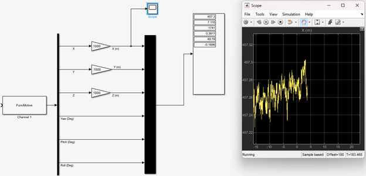
 <figcaption align = "center">Figure X: MATLAB Displaying Position and Rotation Data     </figcaption>
  </p>
</figure>
<!--Picture 2-->
<figure align = "center">
  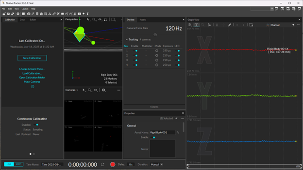
  <figcaption align = "center">Figure X: Motive Displaying Position Data     </figcaption>
  </p>
</figure>

### 5.2 - Setting up Computer 1 to rebroadcast Motive Data to be received in Simulink on another computer.  

1. FuncMotive.m only works on the computer running Motive (Computer 1), therefore we need to rebroadcast the data in Simulink so that it can be received on another computer.  

2. Add a UDP Send block from the Instrument Control Toolbox and connect it to the same data lines as the display block
<!--Picture 1-->
<figure align = "center">
  
 <figcaption align = "center">Figure 1. UDP Send in the Simulink Library Browser     </figcaption>
  </p>
</figure>
<!--Picture 1-->
<figure align = "center">
  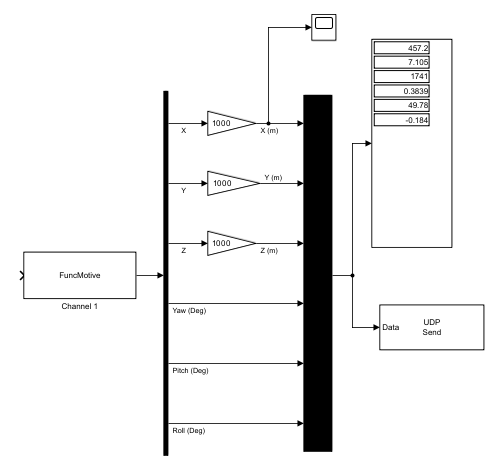
 <figcaption align = "center">Figure X: UDP Send block placed and connected     </figcaption>
  </p>
</figure>

3. Use these settings for the UDP Send from the Instrument Control Toolbox. You need to set the remote. Make sure to disable “Enable blocking mode: ” 
<!--Picture 1-->
<figure align = "center">
  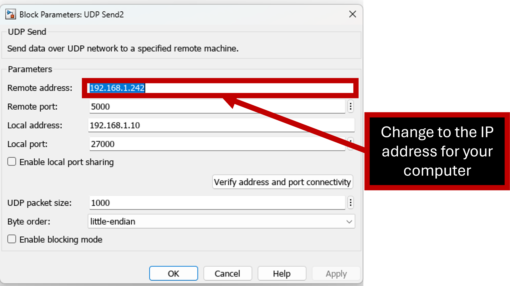
 <figcaption align = "center">Figure X: Settings for the UDP Send Box     </figcaption>
  </p>
</figure>

4. OPTIONAL: Add a Set Pace block and/or a Real-Time Sync to your simulation. The Set Pace and Real-Time Sync blocks regulate the sample rate of the computer. This isn't required on Computer 1 as we are not recording any data here
<!--Picture 1-->
<figure align = "center">
  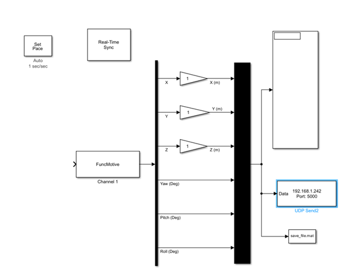
 <figcaption align = "center">Figure X: Simulink Model to create on Computer 1.     </figcaption>
  </p>
</figure>

    4a. Utilize the Set Pace block to run the simulation so that the simulation time is equal to real time. (1 sim second = 1 real world second)
<!--Picture 1-->
<figure align = "center">
  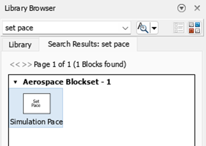
 <figcaption align = "center">Figure X: Aerospace Blockset – Set Pace Blockset.     </figcaption>
  </p>
</figure>
 <!--Picture 2-->
<figure align = "center">
  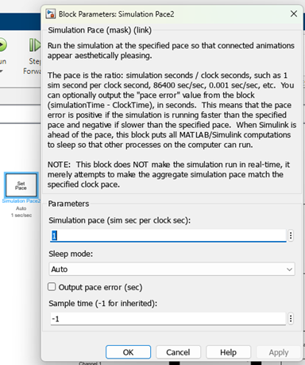
 <figcaption align = "center">Figure X: Settings for Set Pace – Match Sim Pace to Clock Time, with Inherit Sample Time setting      </figcaption>
  </p>
</figure> 

    4b. Utilize the Real-Time Sync block to make sure the simulation samples at the correct rate.
<!--Picture 1-->
<figure align = "center">
  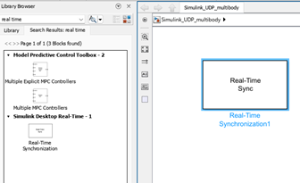
 <figcaption align = "center">Figure X: Simulink Desktop Real-Time - Real-Time Sync Block      </figcaption>
  </p>
</figure>
<!--Picture 2-->
<figure align = "center">
  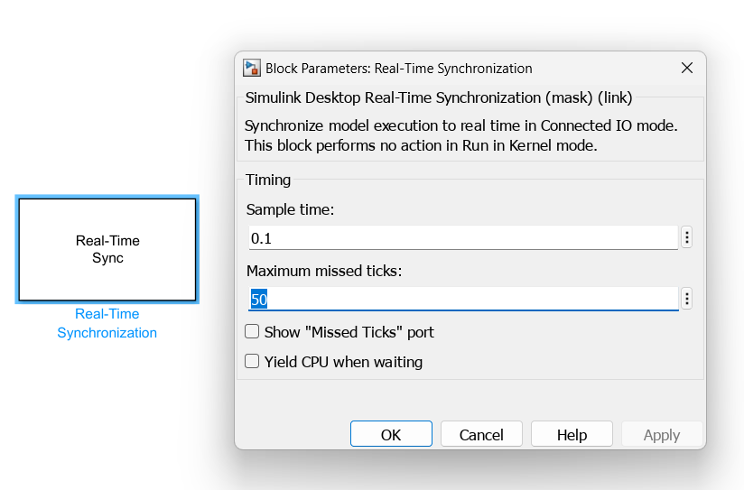
 <figcaption align = "center">Figure X: Setting for Real-Time Sync      </figcaption>
  </p>
</figure>

5. Congratulations! You are now sending via UDP communication to YOUR COMPUTER.  
    * NOTE: Computer 1 is now sending data to the particular IP address and Port Number as described. User Datagram Protocol (UDP) does not need a handshake with the receiver and when running is sending as much data as decided by the Real-Time Synchronization. In this case it is commanded to act at a sample rate of 0.1 seconds. 


### 5.3 - Setting up Your Computer to receive Motive Data from Computer 1 Simulink. 

1. Follow the same steps as 5.1 on your own computer, but do not run the code at the end.  
    * You may skip the steps relating to FuncMotive - we are going to connect UDP Receive to this Simulink Model. 
    * NOTE: Make sure to save often and save once you are done with this step your Simulink Model on Your Computer should look like this: 
<!--Picture 1-->
<figure align = "center">
  
 <figcaption align = "center">Figure X: Simulink Setup on Your Computer      </figcaption>
  </p>
</figure>

2. You will need to the following MATLAB addons, make sure you have them installed. To check if you have it and or need to install it click the addons button in Matlab 
    * NOTE: Make sure you are connected to the school Wi-fi network to have internet access. 
<!--Picture 1-->
<figure align = "center">
  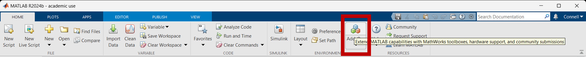
 <figcaption align = "center">Figure X: MATLAB Addon Button     </figcaption>
  </p>
</figure>

    2a. Search for Instrument Control Toolbox in the addon browser, it is made by MathWorks.
<!--Picture 1-->
<figure align = "center">
  
 <figcaption align = "center">Figure X: Instrument Control Toolbox Addon      </figcaption>
  </p>
</figure>
    2b. Search for Aerospace Blockset Addon in the addon browser, it is made by MathWorks.
<!--Picture 2-->
<figure align = "center">
  
 <figcaption align = "center">Figure X: Aerospace Blockset Addon      </figcaption>
  </p>
</figure>
    2c. Search for Simulink Desktop Real-Time Addon in the addon browser, it is made by MathWorks.
<!--Picture 3-->
<figure align = "center">
  
 <figcaption align = "center">Figure X: Simulink Desktop Real-Time Addon      </figcaption>
  </p>
</figure>

3. Once Matlab has restarted, go back to Simulink and comment out FuncMotive block and disconnect it.  
<!--Picture 1-->
<figure align = "center">
  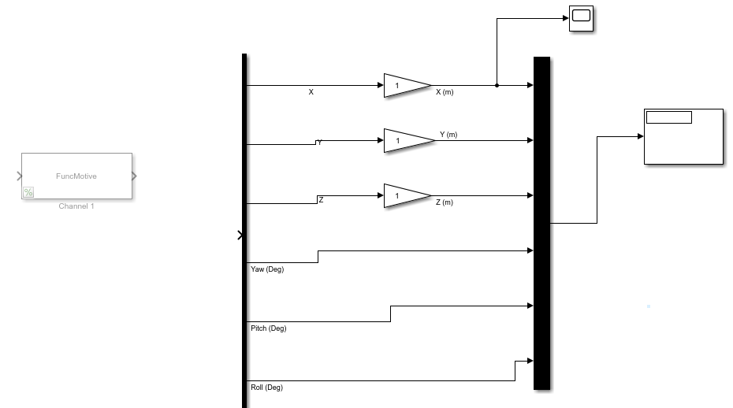
 <figcaption align = "center">Figure X: Comment out FuncMotive Block      </figcaption>
  </p>
</figure>

4. Grab a UDP Receive block from the Instrument Control Toolbox and connect it in place of the FuncMotive block. 
<!--Picture 1-->
<figure align = "center">
  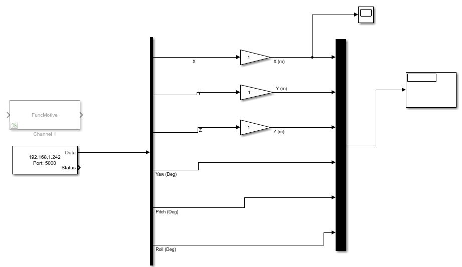
 <figcaption align = "center">Figure X: Insert UDP Recieve Block      </figcaption>
  </p>
</figure>

7. Double click to set the settings for the UDP Receive block.
<!--Picture 1-->
<figure align = "center">
  
 <figcaption align = "center"> Figure X: UDP Receive Config     </figcaption>
  </p>
</figure>  

8. OPTIONAL: Add a Set Pace block and/or a Real-Time Sync to your simulation. The Set Pace and Real-Time Sync blocks regulate the sample rate of the computer. This will be needed later when collecting data so that the time stamps in the simulation matchs real world time.
    * Your student computer may also be able to support the real-time sync block. However this may depend on the student’s computer it is not as necessary and can be skipped as compared to the Set Pace Block.
<!--Picture 1-->
<figure align = "center">
  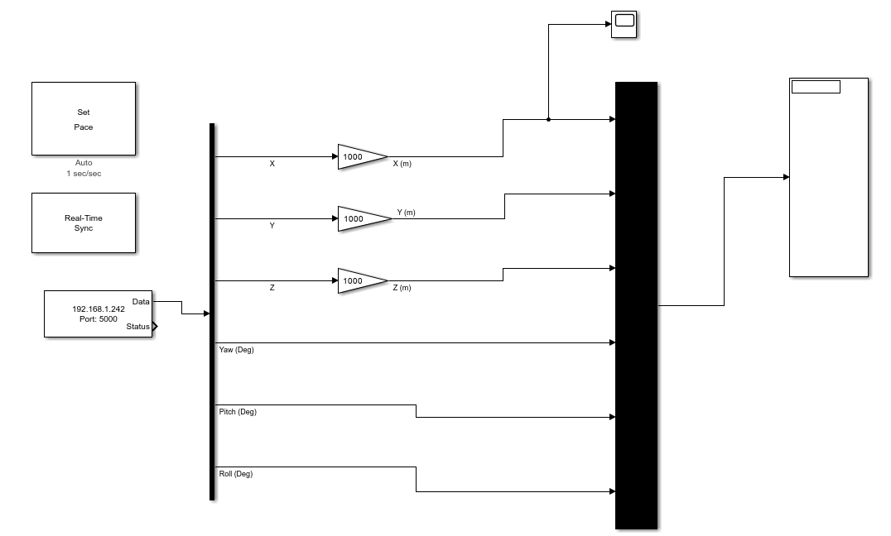
 <figcaption align = "center">Figure X: Set-Pace and Real-Time Blocks     </figcaption>
  </p>
</figure>

    8a. Utilize the Set Pace block to run the simulation so that the simulation time is equal to real time. (1 sim second = 1 real world second)
<!--Picture 1-->
<figure align = "center">
  
 <figcaption align = "center">Figure X: Aerospace Blockset – Set Pace Blockset.     </figcaption>
  </p>
</figure>
 <!--Picture 2-->
<figure align = "center">
  
 <figcaption align = "center">Figure X: Settings for Set Pace – Match Sim Pace to Clock Time, with Inherit Sample Time setting      </figcaption>
  </p>
</figure> 

    8b. Utilize the Real-Time Sync block to make sure the simulation samples at the correct rate.
<!--Picture 1-->
<figure align = "center">
  
 <figcaption align = "center">Figure X: Simulink Desktop Real-Time - Real-Time Sync Block      </figcaption>
  </p>
</figure>
<!--Picture 2-->
<figure align = "center">
  
 <figcaption align = "center">Figure X: Setting for Real-Time Sync      </figcaption>
  </p>
</figure>
 
9. If you are using the Real-Time Sync block you will need to run this command: 'sldrtkernel -setup' in MATLAB to setup Real Time Sync. (Only have to do this the first time you use Real-Time Sync) 
 <!--Picture 1-->
<figure align = "center">
  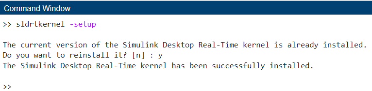
 <figcaption align = "center">Figure X: Running 'sldrtkernel -setup' to activate the real-time synchronization     </figcaption>
  </p>
</figure>

10. Hit run and should receive data ( Rigid body was oscillated in the x-direction ) 
<!--Picture 1-->
<figure align = "center">
  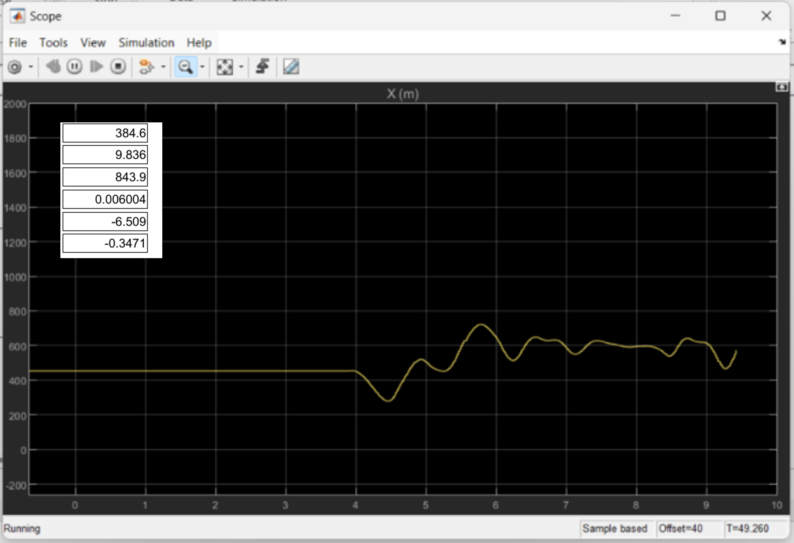
 <figcaption align = "center">Figure X: Data Captured from Remote Computer      </figcaption>
  </p>
</figure>

#### Learning Objectives
<div style="color:black; background:lightblue; border: 1px dashed black">

``` 
Objectives: 
1. Download NatNet SDK on Computer 1

2. Download udp_c_comm_matlab_simulink.zip on Computer 1

3. Validate and verify correct settings in the FuncMotive function on Computer 1

4. Update Simulink Sim on Computer 1

5. Create UDP Send in Simulink Sim using Instrument Control Tool Box 

6. Receive Optitrack Data from Motive to Simulink on Computer 1 

7. Broadcast Optitrack Data from Simulink on Computer 1 

8. Create Simulink Model on your Computer with UDP Receive function. 

9. Receive Optitrack data in Simulink on your Computer. 

10. Document and report on all steps as outlined. 
``` 
</div>

<br><!--Paragraph-->
<br><!--Paragraph-->
<br><!--Paragraph-->

## 6: EXTRA CREDIT - Using MATLAB Simulink 3D Animation to create a virtual representation of the data from Motive. 

#### Learning Objectives
<div style="color:black; background:lightblue; border: 1px dashed black">

``` 
1. Run through SImulink Tutorials on how to create 3D animation 

2. Insert the Actor and Simulation 3D Scene Configuration Blocks within your simulink model. 

3. Insert an appropriate CAD STL file for your object (ex. Aircraft, Spacecraft, Rocket, Car, etc...) 

4. Link the input for the Actor to the output of the Motive State Data [XYZ, Roll, Pitch, Yaw] 

5. Demonstrate that your model moves, spins, and is tracked. 
``` 
</div>

### 6.1 Information on how to use Simulink 3D 
1. You will need to have the Simulink 3D Animation addon, to check if you have it and to install it click the addons button in MATLAB. 
    * NOTE: Make sure you are connected to the school Wi-fi network to have internet access. 
<!--Picture 1-->
<figure align = "center">
  
 <figcaption align = "center">Figure X: MATLAB Addon Button     </figcaption>
  </p>
</figure>

2. Search for Simulink 3D Animation in the addon browser, it is made by MathWorks 
<!--Picture 1-->
<figure align = "center">
  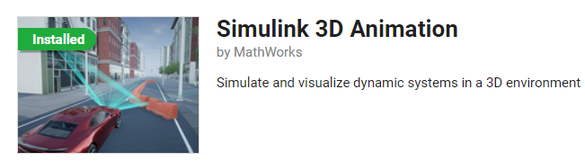
 <figcaption align = "center">Figure X: Simulink 3D Animation Addon      </figcaption>
  </p>
</figure>

3. Once installed, go to the documentation for the addon and go to the get started page and go through the “Create 3D Simulation Using Simulink” documents. 
    * https://www.mathworks.com/help/sl3d/ 
    * https://www.mathworks.com/help/sl3d/create-3d-simulation-using-simulink.html  

4. To open the 3D sim examples, run the command open_system("CreateWorld"); In MATLAB and click the warning about running it in Simulink. https://www.mathworks.com/help/sl3d/create-world-and-actor-using-simulink.html  
<!--Picture 1-->
<figure align = "center">
  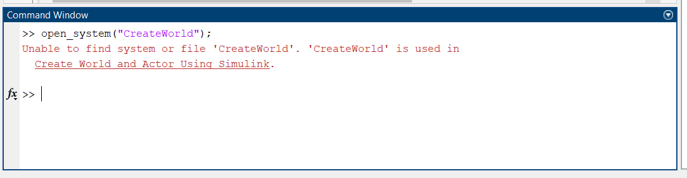
 <figcaption align = "center">Figure X: Using the open_system("CreateWorld"); Command      </figcaption>
  </p>
</figure>


5. It is left to the reader to go through the documentation and examples of how to create and simulate virtual objects in Simulink. 

 

### 6.2 Connecting the Motive Data to a 3D Simulink Simulation.

1. Open the example CreateActorFrom3DGraphic. 
    * open_system("CreateActorFrom3DGraphic"); 

2. Copy the Actor and Simulation 3D Scene Configuration Blocks and paste them into the Simulink_UDP Simulink file. 
<!--Picture 1-->
<figure align = "center">
  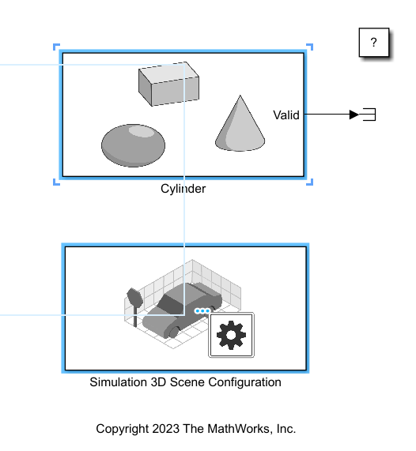
 <figcaption align = "center">Figure X: Simulink Model with 3D blocks inserted.      </figcaption>
  </p>
</figure>

3. Open the Actor Block (Cylinder) and modify variables.  
    3a. Change the variable name of the block as appropriate. 
<!--Picture 1-->
<figure align = "center">
  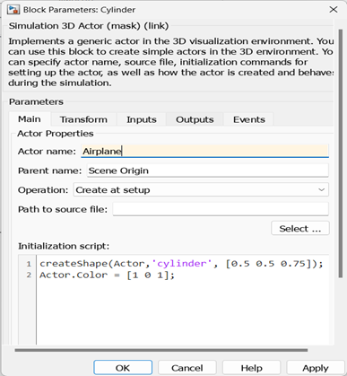
 <figcaption align = "center">Figure X: Actor Variable Name      </figcaption>
  </p>
</figure> 
    3b. Go to the Inputs tab and click on browse at the bottom of the white box, then select translation and hit the right arrow. Then select rotation then hit the right arrow 
<!--Picture 1-->
<figure align = "center">
  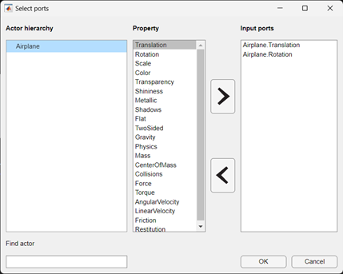
 <figcaption align = "center">Figure X: Setting Up Actor Inputs     </figcaption>
  </p>
</figure>

4. The actor block will now have inputs for translation and rotation. Hook up these inputs. 
    * Set Gains to 1 as inputs are already in meters 
    * Have 2 Mux of 3 inputs each, one for translation and one for rotation 
    * Put a transpose after each Mux, as the Mux creates column vectors and the actor inputs expect row vectors 
    * Insert A gain is needed after. 

5. You should have connection something like this 
    * You may need to mess with gains and switching inputs to get it to work correctly 
    * Inputs are in degrees and you may need to adjust the coordinate frame to account for discontinuity in angle reading. 
<figure align = "center">
  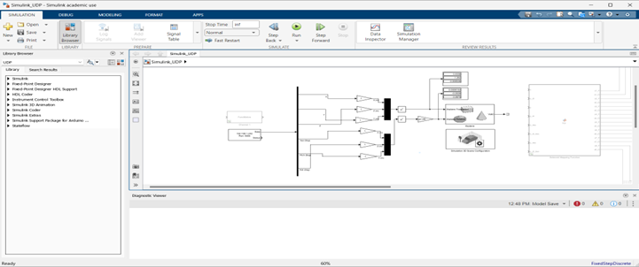
 <figcaption align = "center">Figure X: 3D Simulation Setup     </figcaption>
  </p>
</figure>

6. In the Simulation 3D scene block change the scene view to custom and input. 

7. CONNECT TO Space Robotics Lab WIFI ROUTER 

8. Ensure that Data is being streamed and collected. 

9. Load an optional STL file of your actor. For example a CAD of a Rocket, Satellite, Spacecraft, aircraft, or any other STL format CAD file as appropriate. 
    * Replace the createshape with 
    * load(Actor,'Simcraft_Assembly_V3_EVERYTHING_PART.STL', (1/39.8/100)*[1 1 1]); 

10. Your Simulink should now have a visualization of a CAD object that moves with the Motive state data [X,Y,Z, Roll, Pitch, Yaw] 
<!--Picture 1-->
<figure align = "center">
  
 <figcaption align = "center">Figure 1.     </figcaption>
  </p>
</figure>


Figure X: Example Virtual Object that Moves with Motive Data. 


#### Learning Objectives
<div style="color:black; background:lightblue; border: 1px dashed black">

``` 
1. Run through SImulink Tutorials on how to create 3D animation 

2. Insert the Actor and Simulation 3D Scene Configuration Blocks within your simulink model. 

3. Insert an appropriate CAD STL file for your object (ex. Aircraft, Spacecraft, Rocket, Car, etc...) 

4. Link the input for the Actor to the output of the Motive State Data [XYZ, Roll, Pitch, Yaw] 

5. Demonstrate that your model moves, spins, and is tracked. 
``` 
</div>

<!--THE END-->