# Lab 1: Optitrack Camera Calibration and Communication 

Authors:

Connell Crawford, 

Alexander Debartolo,

Stephen Kwok-Choon

## Introduction 

Optitrack is platform that allows the tracking of defined rigid body objects in a test environment through the use of optical tracking markers. 

The Space Robotics Laboratory (SRL) is equipped with four (4) optical tracking cameras – the Prime^x 13/13W  cameras.

<figure>
  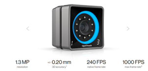
  <figcaption>Figure 1. Prime X 13 Camera.  </figcaption>
</figure>

Shown in Fig 1. Each camera has a resolution of up to 1.3 Megapixels, with a 3D tracking accuracy of up to 0.20 mm, rated natively up to 240 Frames Per Second, with a maximum frame rate of 1000 Frames Per Second.


<figure>
  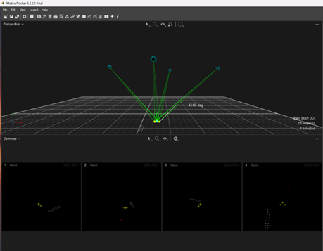
  <figcaption>Figure 2. A representation of the Motive Software tracking a rigid body object. Lines of sight of each camera is shown.  </figcaption>
</figure>

Shown in Figure 3. is the room layout and the position of the cameras in the room layout. 

<figure>
  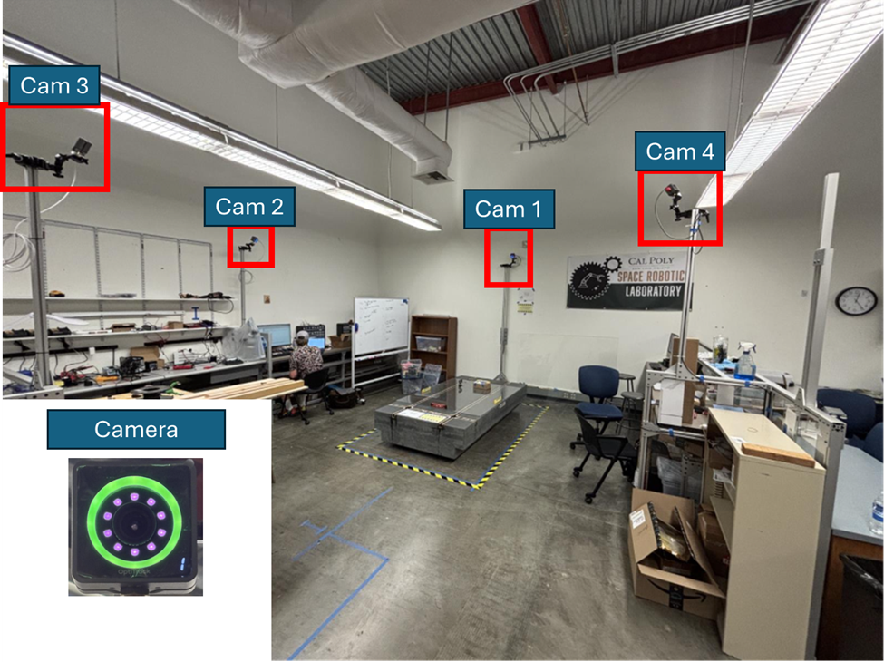
  <figcaption>Figure 3. Room Layout  </figcaption>
</figure>

### Room Layout (4- Camera Optitrack Array)

Illustrated here in Fig X and X is the floor plan of the SRL as well as an illustration of the line of sight of each camera.

<p align="center">
  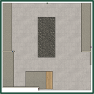
&nbsp; &nbsp; &nbsp;
  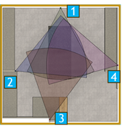
</p>
<p align = "center">
  <caption> Figure 4. LEFT: Floor Illustration, RIGHT: Camera View Angle </figcaption>
</p>

### Wiring Data Connection Diagram


Shown here in Fig. 7 is a wiring connection diagram of the cameras, switch, Wi-Fi router as well computer 1 and 2.

<figure>
  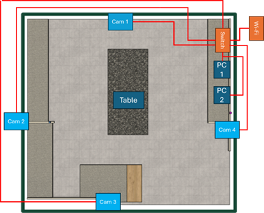
  <figcaption>Figure 7. Computer 1 (LEFT) and Computer 2 (RIGHT)  </figcaption>
</figure>


Shown here in fig. 8 are the two computers that are connected to the Switch and Optitrack computers. Computer 1 on the left is used to operate Motive software for the Optitrack Camera network.


<figure>
  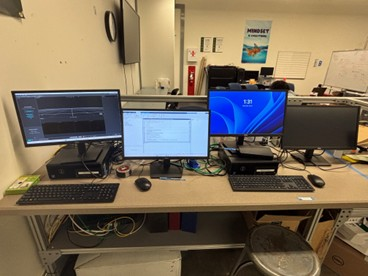
  <figcaption>Figure 8. Computer 1 (LEFT) and Computer 2 (RIGHT)  </figcaption>
</figure>


#### Learning Objectives

<div style="color:black; background:lightblue; border: 1px dashed black">

``` 
Objectives: 
1.	Understand how the cameras function and find position
2.	Understand how the Lab Network
3.	Facilitating the use of the Motive Software and Cameras
  a.	Calibrate Cameras
  b.	Create Ridged Bodies
  c.	Broadcast Data from Motive to adjacent software
4.	Detect and display data from Motive in Matlab
5.	Detect and display data from Motive in Simulink
6.	Create 3D simulations in Simulink
7.	Link the data from motive and input into 3D simulink simulation 
``` 
</div>


## 1: Starting Things Up
1.	Set up the space:
  a.	Remove objects blocking the cameras
  b.	During operation and testing, minimize camera line of sight obstructions.
  c.	Remove highly reflective objects and high vis items
2.	Make sure to clear the space of things that block the cameras, and anything that is high visibility or highly reflective as it will add clutter and confusion when operating the cameras.
3.	Turn on both computers, the network switch, and the router. 
  a.	The power switches to turn the network switch and router on are behind the computer monitors. 

<figure>
  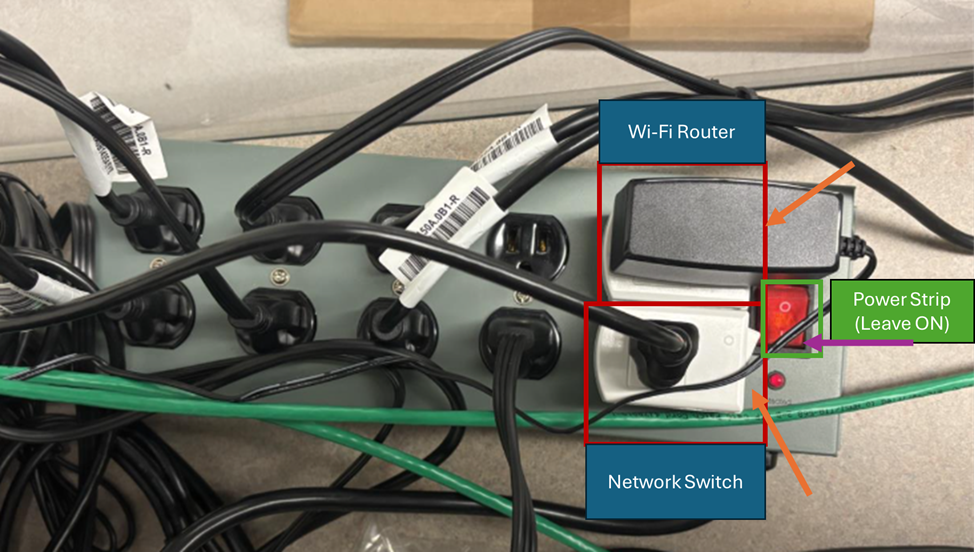
  <figcaption>Figure 9. Power Strip  </figcaption>
</figure>

4.	Log in on both computers 1 and 2 (refer to figure X).
5.	On computer 2 , open MATLAB Simulink
6.	Turn on the network switch and the router, the switches to turn them on is behind the computer monitors
7.	Wait for the network switch to turn on. This may take a minute or two:

  <p align="center">
    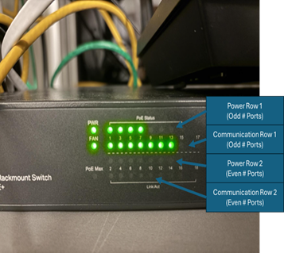
    &nbsp; &nbsp; &nbsp;
    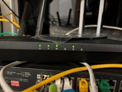
  </p>
  <p align = "center">
    <caption> Figure 10. Network Switch (LEFT), WiFi and Local Network Router (RIGHT) </figcaption>
  </p>

    a. This can be seen by looking at the lights on the switch, the first row of lights shows that power is being provided, there should be four lights on this row showing that the 4 cameras are being provided power

    b. On the next row there should be 7  flashing lights, these lights show that communication is happening between the 4 cameras and the left computer and the router, the router will also be connected to the right computer. 

    c.	The cameras will have numbers in the bottom right corner when motive is open and connected to the cameras showing how the software decided to label the cameras, and the cameras will have solid blue or green rings around the lens. (Color of ring – refer to calibration)

8. Open Motive on the 1 Computer 


<figure><p align = "center">
  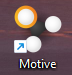
  <figcaption>Figure 10. Motive Icon  </figcaption>
  </p>
</figure>

  a. The Motive Software should show that four cameras are connected under the Cameras tab.

  b. The cameras may not appear in the same order as listed in figure X.

<figure>
  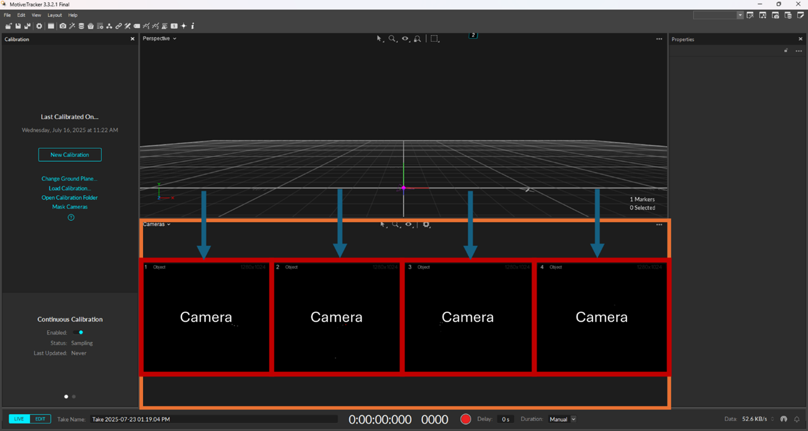
  <figcaption>Figure 11. Motive Camera Layout  </figcaption>
</figure>

## 2: How to Calibrate the Cameras in the Motive Software

<div style="color:black; background:lightblue; border: 1px dashed black">

``` 
Objectives:
 
1. Completing Calibration of Cameras
2. Obtain a Calibration of “Exceptional” or as good as possible.
3. Set the Global XYZ reference Frame.
4. Get screenshots and pictures for lab report

``` 
</div>

### 2.1 Optitrack Camera Calibration

1.	To calibrate the cameras, you will need the calibration wand and calibratio n square

<figure>
  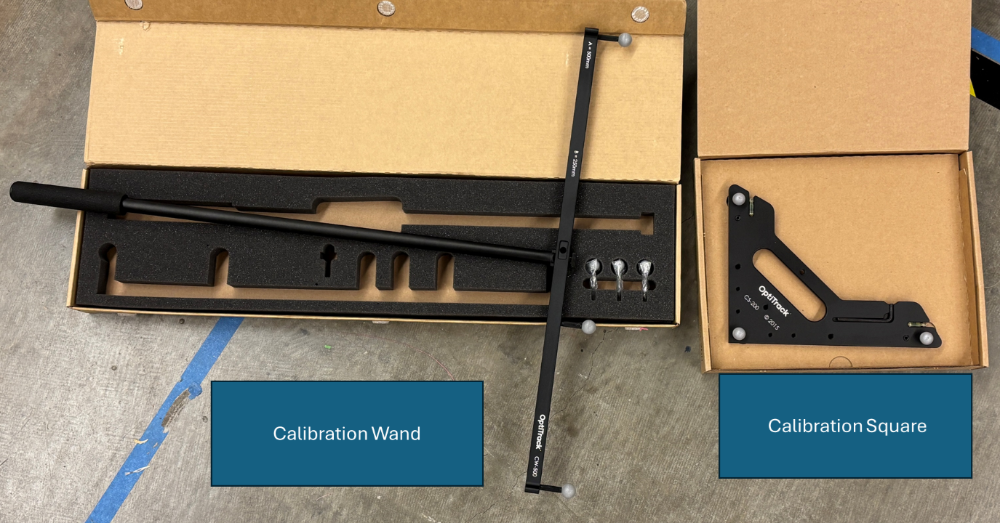
  <figcaption>Figure 12. Calibration Wand and Calibration Square  </figcaption>
</figure>

2. To reset the layout of Motive, go to the menu bar at the top left and click on the Layout button then click on the Calibration button as shown in figure 13.

<figure>
  
  <figcaption>Figure 13. Calibration Layout  </figcaption>
</figure>

3.	To start the calibration of the cameras, go to the calibration tab in Motive and select New Calibration.

<figure>
  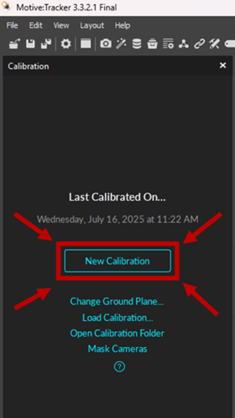
  <figcaption>Figure 14. New Calibration  </figcaption>
</figure>


<br><!--Paragraph-->
<br><!--Paragraph-->
<br><!--Paragraph-->

## 4: Getting Data from the Motive Software into Matlab: 

#### Learning Objectives
<div style="color:black; background:lightblue; border: 1px dashed black">

```
1. Download Optitrack MATLAB Plugin 1.1.0 (Current Version) 

2. Connect to SRL Wi-Fi Router with IP settings 

3. Obtain your computer Wi-Fi  IP address 

4. Extract the Matlab Plugin and change the appropriate IP address settings 

5. Run the Matlab script - OptiSample_RigidBodyGraph.m 

6. Demonstrate that sample data is streaming to your Laptop. 

7. Document all steps in your team lab report. 
```
</div>

 

## 4.1 - Downloading Optitrack MATLAB Plugin 1.1.0 

1. Create a folder called OptiTrack for organizing files related to this lab.  

2. First download MATLAB Plugin 1.1.0, (the version may be different) which includes software that is able to receive data from Motive. 
    *  Go to https://optitrack.com/support/downloads/plugins.html or go to https://optitrack.com/ and click on support>downloads>plugins 
    * Scroll down this page until you see MATLAB Plugin 1.1.0 and download the software. 
    * NOTE: Make sure you are connected to the school Wi-fi network to have internet access. 
<!--Picture 1-->
<figure>
  
  <figcaption>Figure 1.     </figcaption>
</figure>
Figure X: MATLAB Plugin for Connecting to Motive 

3. Once the download is complete, move OptiTrack_MATLAB_Plugin_1.1.0.zip to the folder OptiTrack. 

4. Extract/Unzip OptiTrack_MATLAB_Plugin_1.1.0.zip 
<!--Picture 1-->
<figure>
  
  <figcaption>Figure 1.     </figcaption>
</figure>
Figure X: Unzipped the OptiTrack_MATLAB_Plugin_1.1.0.zip Folder 

5. Open the unzipped OptiTrack_MATLAB_Plugin_1.1.0, then open the Matlab folder 
    * Inside you will find some examples of Matlab scripts that are able to capture data from Motive. 
<!--Picture 1-->
<figure>
  
  <figcaption>Figure 1.     </figcaption>
</figure>
Figure X: Opening the Unzipped OptiTrack_MATLAB_Plugin_1.1.0.zip folder 
<!--Picture 1-->
<figure>
  
  <figcaption>Figure 1.     </figcaption>
</figure>
Figure X: Opening the Matlab Folder 

6. Open the natnet.m and OptiSample_RigidBodyGraph.m scripts in MATLAB. These scripts take the position and rotational data from Motive and displays it as a graph.   
<!--Picture 1-->
<figure>
  
  <figcaption>Figure 1.     </figcaption>
</figure>
Figure X: Showing the OptiTrack_MATLAB_Plugin_1.1.0.m opened in Matlab 

## 4.2 - Connecting to the Space Robotics Wi-Fi Router 

1. Connect to the Wi-Fi Router SPACE_ROBOTICS_LAB. The professor will give you the password. 
    * NOTE: When connecting to the Wi-Fi router you need to connect with a fixed IP address. The Wi-Fi Router is assigned as 192.168.1.12.  Subnet mask 255.255.255.0 
    * Your Wi-Fi setting in your computer should assign itself a number to the same path 192.168.1.X, with X a number assigned between 0 and 255. 
    * NOTE: This network is not connected to the internet.  
    * Do not set to auto connect. 

2. Open Command Prompt. You can use the windows search to find it. 

3. Type ipconfig into command prompt. You are looking the Default Gateway with the IP address of 192.168.1.12. Two lines above is the IPv4 address of the computer you are on.  
<!--Picture 1-->
<figure>
  
  <figcaption>Figure 1.     </figcaption>
</figure>
Figure X: Finding the IP address for your computer 

4. Make sure that Motive is set to Streaming and the tabs for streaming are turned on. 
<!--Picture 1-->
<figure>
  
  <figcaption>Figure 1.     </figcaption>
</figure>
Figure X: Streaming in Motive software is turned on. 

 


### 4.3 - Setting Up MATLAB to receive data from Motive 
1. In MATLAB go into the natnet.m file and change the IP addresses. 

2. Your computer is the client and is the IP address we found in step 4.2.3 

3. The Motive computer is the host and is 192.168.1.10 
<!--Picture 1-->
<figure>
  
  <figcaption>Figure 1.     </figcaption>
</figure>
Figure X: Setting the Host and Client IP address in Matlab on YOUR computer. 

4. In MATLAB go into the OptiSample_RigidBodyGraph.m file and change the IP addresses. 

5. Your computer is the client and is the IP address we found in step 4.2.3 
    * The Motive computer is the host and is 192.168.1.10 
<!--Picture 1-->
<figure>
  
  <figcaption>Figure 1.     </figcaption>
</figure>
Figure X: Matlab script IP address settings. 

6. Run the OptiSample_RigidBodyGraph.m script.  
<!--Picture 1-->
<figure>
  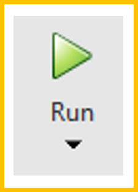
  <figcaption>Figure X: Matlab Run script button 😊      </figcaption>
</figure>

 
The first time you run this script you will have to tell MATLAB about where the library for connecting MATLAB to MOTIVE is. You will find the library by going up one folder and selecting NatNetML.dll 
<!--Picture 1-->
<figure>
  
  <figcaption>Figure 1.     </figcaption>
</figure>
Figure X: Selecting The Library for MOTIVE to MATLAB Communication 

Upon successful connection Matlab will obtain telemetry data from Motive both posted in the command window as well as graphed in Figure 1. The Frame number should be increasing with progression in time. 
<!--Picture 1-->
<figure>
  
  <figcaption>Figure 1.     </figcaption>
</figure>
Figure X: MATLAB Receiving Telemetry Data from Motive 

NOTE: Reconnect to the School Network to resume internet access. 

#### Learning Objectives
<div style="color:black; background:lightblue; border: 1px dashed black">

```
1. Download Optitrack MATLAB Plugin 1.1.0 (Current Version) 

2. Connect to SRL Wi-Fi Router with IP settings 

3. Obtain your computer Wi-Fi  IP address 

4. Extract the Matlab Plugin and change the appropriate IP address settings 

5. Run the Matlab script - OptiSample_RigidBodyGraph.m 

6. Demonstrate that sample data is streaming to your Laptop. 

7. Document all steps in your team lab report. 
```
</div>


<br><!--Paragraph-->
<br><!--Paragraph-->
<br><!--Paragraph-->

## 5: Getting Data from the Motive Software into Matlab Simulink 

#### Learning Objectives
<div style="color:black; background:lightblue; border: 1px dashed black">

```
1. Download NatNet SDK on Computer 1

2. Download udp_c_comm_matlab_simulink.zip on Computer 1 

3. Validate and verify correct settings in the FuncMotive function on Computer 1 

4. Update Simulink Sim on Computer 1 

5. Create UDP Send in Simulink Sim using Instrument Control Tool Box 

6. Receive Optitrack Data from Motive to Simulink on Computer 1 

7. Broadcast Optitrack Data from Simulink on Computer 1 

8. Create Simulink Model on your Computer with UDP Receive function. 

9. Receive Optitrack data in Simulink on your Computer. 

10. Document and report on all steps as outlined. 
```
</div>

### 5.1 How to get receive Motive data in Simulink using FuncMotive.m on Computer 1 Only. 

1. First download NatNet SDK, which are software libraries and functions that can receive the data from Motive. 

    * Go to https://optitrack.com/support/downloads/developer-tools.html#natnet-sdk or go to https://optitrack.com/ and click on the software tab, then scroll down to NatNet SDK and click learn more, then click download the NatNet SDK.  

    * NOTE: Make sure you are connected to the school Wi-fi network to have internet access. 

    * On this page, you can click on the download link. https://optitrack.com/support/downloads/developer-tools.html  

    * NOTE: the version of NatNet_SDK may be different at the time of downloading of the SDK. 

<figure>
  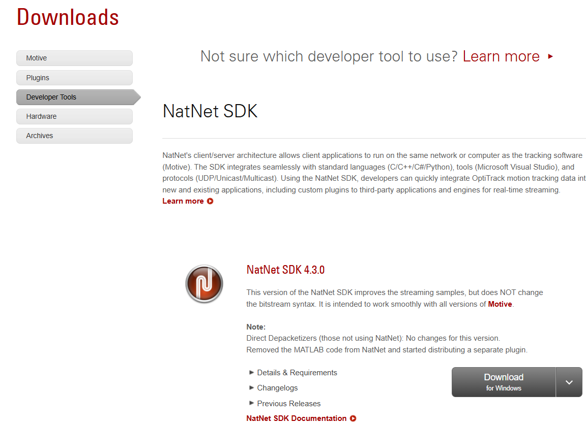
  <figcaption>Figure 1. Download NatNetSDK into a folder in your workspace:  Optitrack >  Downloads > Developer Tools > NatNetSDK.  </figcaption>
</figure>


2. Download udp_c_comm_matlab_simulink.zip from Canvas (Provided by the instructor of the lab). 

3. Once the downloads are complete, move NatNet_SDK_4.3.zip and udp_c_comm_matlab_simulink.zip to the same folder -  Optitract folder.
    * NOTE: the version of NatNet_SDK may be different at the time of downloading of the SDK. So, you may see numbers other than 4.3. 

4. Make the OptiTrack folder for Computer 1. 

5. Extract/Unzip NatNet_SDK_4.3.zip and udp_c_comm_matlab_simulink.zip each zip file respectively into the OptiTrack folder.  

6. Verify you have these MATLAB Addons  
    * Instrument Control Toolbox Addon 
    * Aerospace Blockset Addon 
    * Simulink Desktop Real-Time Blockset Addon 
<!--Picture 1-->
<figure>
  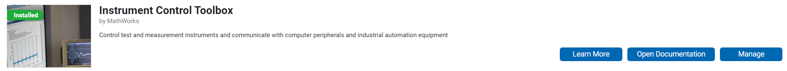
  <figcaption>Figure 1. Instrument Control Toolbox Addon.  </figcaption>
</figure>
<!--Picture 2-->
<figure>
  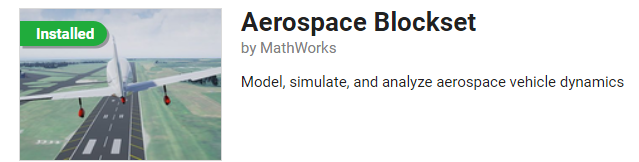
  <figcaption>Figure 1. Aerospace Blockset Addon.  </figcaption>
</figure>
<!--Picture 3-->
<figure>
  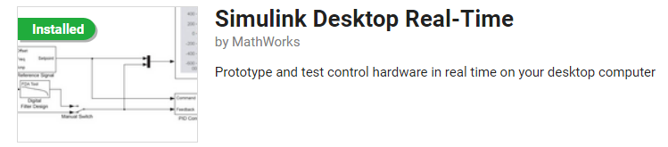
  <figcaption>Figure 1. Simulink Desktop Real-Time Blockset Addon.  </figcaption>
</figure>

7. Reconnect to the Router:  SPACE_ROBOTICS_LAB 
8. In MATLAB, open the Funcmotive.m file in the udp_c_comm_matlab_simulink folder.
<figure>
  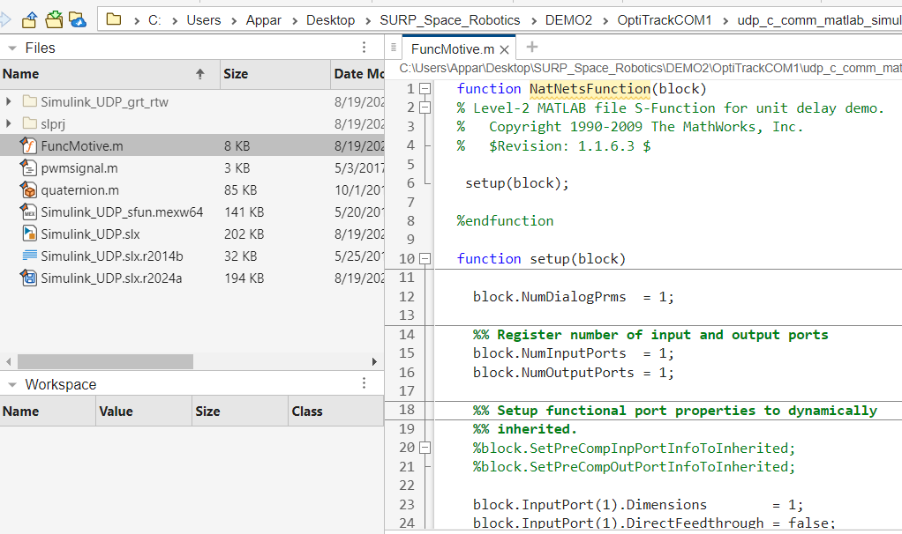
  <figcaption>Figure 1. This is what you should see when you open the FuncMotive.m file in Matlab.   </figcaption>
</figure>

9. Scroll down the file until you find the line of code that is trying to point to the NatNet_SDK_X. Find this line (Line 98): dllpath = fullfile(... 
<figure>
  
  <figcaption>Figure 1. Need to update the dllPath.    </figcaption>
</figure>

    * In the version that you have unzipped it is: 

    * dllPath = fullfile('c:','Users','ORION1','Desktop','Stephen KWOK CHOON DO NOT TOUCH','Motive Streaming','NatNet_SDK_2.8','NatNetSDK','lib','x64','NatNetML.dll'); 

    * The dllPath has to point to the NatNetML.dll file located inside the NatNet_SDK_X.X  developer folder that you have downloaded. 


10. Open the NatNet_SDK_4.3 folder and go down the path > NatNetSDK > lib > x64 

    * NOTE: the version of NatNet_SDK may be different at the time of downloading of the SDK. 

    * Your path may look like this: C:\Users\skwokcho\Desktop\Optitrack\NatNet_SDK_4.3\NatNetSDK\lib\x64

11. Copy the path at the top of the folder.  
<figure>
  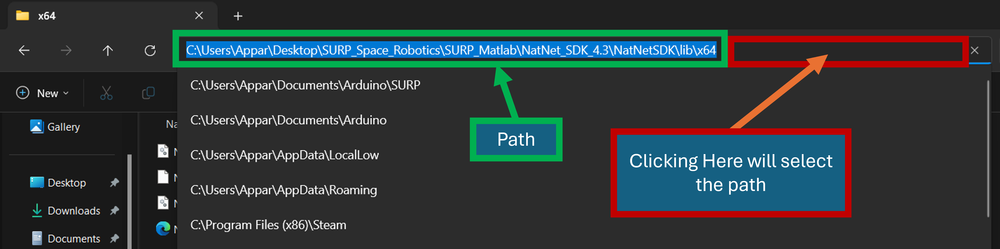
  <figcaption>Figure 1. Showing two different ways to find the file path for the NatNetML.dll file.     </figcaption>
</figure>

12. Paste the path in the FuncMotive.m script, above the dllPath line of code (see figure X in step 7 and 11.). And make sure to comment out the path as shown. 
<figure>
  
  <figcaption>Figure 1.     </figcaption>
</figure>

13. Change the existing dllPath path to the path that was pasted above and point to NatNetML.dll . Refer to figure X. 
<figure>
  
  <figcaption>Figure 1.     </figcaption>
</figure>
Figure X: Showing the updated dllPath in the FuncMotive.m file. 

14. Make sure the Matlab workspace file path points back to the FuncMotive.m folder 
<figure>
  
  <figcaption>Figure 1.     </figcaption>
</figure>
Figure X: Matlab Pointing to the correct folder that contains the FuncMotive.m file. 

15. Change the IP address in Funcmotive.m to the IP Address of the computer running Motive. This is because the Motive software is broadcasting on Computer 1 on the IP address of “192.168.1.10” 
<figure>
  
  <figcaption>Figure 1.     </figcaption>
</figure>
Figure X: Changing IP address of the Host in FuncMotive.m 


16. Then open Simulink_UDP.slx in MATLAB Simulink 
<figure>
  
  <figcaption>Figure 1.     </figcaption>
</figure>
Figure X: Simulink Block diagram of Simulink_UPD.slx file.  

NOTE: This Simulink template contains example segments of code that are not currently necessary but can be implemented later for control of a vehicle. We are going to edit and comment out parts of the Simulink model that are not needed at this moment in time. 

17. Close the Scope window if it is in your way 

18. To move around in Simulink, you can zoom in and out using the scroll wheel. You can also hold the middle mouse button and move the mouse to move around the workspace 
    * You can click and drag the boxes and lines around to connect and organize them.  

19. Comment out all the control blocks after and including the big Matlab Block named “Solenoid Mapping Function” by holding left clicking off to the side and drawing a big selection box. Then right click on the Matlab Block and select Comment Out. 
<figure>
  
  <figcaption>Figure 1.     </figcaption>
</figure>

20. Disconnect the lines to the commented-out code by clicking and dragging the end of the arrows. 
<figure>
  
  <figcaption>Figure 1.     </figcaption>
</figure>

21. Go to the right end of the control section and copy the black box(mux) and text box(display). 
<figure>
  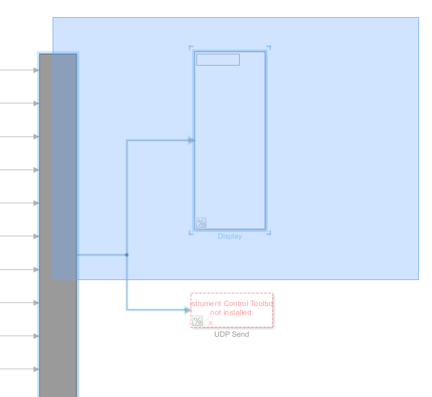
  <figcaption>Figure 1. Copying Mux and Display Blocks    </figcaption>
</figure>

22. Paste it next to the lines you disconnected earlier and “uncomment” the mux and display to activate them. You may need to move the previously commented blocks to the left to make some space.  
<figure>
  
  <figcaption>Figure 1.     </figcaption>
</figure>

23. Change the mux so that it has 6 inputs.  
    * NOTE: If you are tracking 2,3, ... X rigid body objects this needs to be adjusted accordingly. Each rigid body object provides Position [X,Y,Z] and Orientation [Theta, Psi, Phi] OR Quaternion [Qw,Qx,Qy,Qz] - Refer to the FuncMotive.m file for customization – Or ask the instructor :)  
<figure>
  
  <figcaption>Figure 1.     </figcaption>
</figure>

24. Connect X, Y, Z, Yaw, Pitch, and Roll to the Mux (black box). You will need to delete the terminates on the Z and angle values. Also delete the d/dt, derivative blocks. You can also add a scope to any of the channels.  
<figure>
  
  <figcaption>Figure 1.     </figcaption>
</figure>

25. Verify Motive has the correct broadcast settings. 
<figure>
  
  <figcaption>Figure 1. Verify Motive Broadcast Settings    </figcaption>
</figure>

26. Click run on Simulink. You should see data being streamed and displayed from Motive.
<!--Picture 1-->
<figure>
  
  <figcaption>Figure 1.     </figcaption>
</figure>
<!--Picture 2-->
<figure>
  
  <figcaption>Figure 1.     </figcaption>
</figure>


### 5.2 - Setting up Computer 1 to rebroadcast Motive Data to be received in Simulink on another computer.  

1. FuncMotive.m only works on the computer running Motive (Computer 1), therefore we need to rebroadcast the data in Simulink so that it can be received on another computer.  

2. Add a UDP Send block from the Instrument Control Toolbox and connect it to the data lines 
<!--Picture 1-->
<figure>
  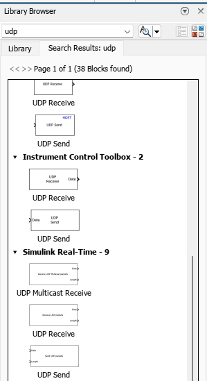
  <figcaption>Figure 1. UDP Send in the Simulink Library Browser     </figcaption>
</figure>
<!--Picture 1-->
<figure>
  
  <figcaption>Figure 1.     </figcaption>
</figure>
Figure X: INFO 


3. Use these settings for the UDP Send from the Instrument Control Toolbox. You need to set the remote. Make sure to disable “Enable blocking mode: ” 
<!--Picture 1-->
<figure>
  
  <figcaption>Figure 1.     </figcaption>
</figure>
Figure X: Settings for the UDP Send Box 


4. Add the Real-Time Sync and Set Pace blocks to your simulation. (This Step Not needed – Slows the Simulink Sim.) 
<!--Picture 1-->
<figure>
  
  <figcaption>Figure 1.     </figcaption>
</figure>
Figure X: Simulink Model to create on Student Computer. 


5. Utilize the Set Pace to collect data at a set pace set to 1 sim sec to clock second. 
<!--Picture 1-->
<figure>
  
  <figcaption>Figure 1.     </figcaption>
</figure>
Figure X: Aerospace Blockset – Set Pace Blockset 
 <!--Picture 1-->
<figure>
  
  <figcaption>Figure 1.     </figcaption>
</figure>
Figure X: Settings for Set Pace – Match Sim Pace to Clock Time, with Inherit Sample Time setting 


6. Your student computer may also be able to support the real-time sync block. However this may depend on the student’s computer it is not as necessary and can be skipped as compared to the Set Pace Block. 
<!--Picture 1-->
<figure>
  
  <figcaption>Figure 1.     </figcaption>
</figure>
Figure X: Real-Time Sync Block 
<!--Picture 1-->
<figure>
  
  <figcaption>Figure 1.     </figcaption>
</figure>
Figure X: Setting for Real-Time Sync  


5. Double Click to set the settings for the Real-Time Synchronization under Simulink Desktop Real-Time Toolbox. – Depending on your application you can adjust the sampling rate of the Real-Time Synchronization. For right now set it is okay to sample at  0.1 seconds, with a maximum missed tick of 50. (This Step Not needed – Slows the Simulink Sim.) 
<!--Picture 1-->
<figure>
  
  <figcaption>Figure 1.     </figcaption>
</figure>or Real-Time Synchronization. 
Figure X: Set Pace settings. 

6. Congratulations! You are now sending via UDP communication to YOUR COMPUTER.  
    * NOTE: Computer 1 is now sending data to the particular IP address and Port Number as described. User Datagram Protocol (UDP) does not need a handshake with the receiver and when running is sending as much data as decided by the Real-Time Synchronization. In this case it is commanded to act at a sample rate of 0.1 seconds. 


### 5.3 - Setting up Your Computer to receive Motive Data from Computer 1 Simulink. 

1. Follow the same steps as 5.1 on your own computer, but do not run the code at the end.  
    * You may skip the steps relating to FuncMotive - we are going to connect UDP Receive to this Simulink Model. 
    * NOTE: Make sure to save often and save once you are done with this step your Simulink Model on Your Computer should look like this: 
<!--Picture 1-->
<figure>
  
  <figcaption>Figure 1.     </figcaption>
</figure>
Figure X: Simulink Setup on Your Computer 

2. You will need to have the Instrument Control Toolbox addon, to check if you have it and to install it click the addons button in Matlab 
    * NOTE: Make sure you are connected to the school Wi-fi network to have internet access. 
<!--Picture 1-->
<figure>
  
  <figcaption>Figure 1.     </figcaption>
</figure>
Figure X: MATLAB Addon Button 

3. Search for Instrument Control Toolbox in the addon browser, it is made by MathWorks press the install button. 
<!--Picture 1-->
<figure>
  
  <figcaption>Figure 1.     </figcaption>
</figure>
Figure X: Instrument Control Toolbox Addon 

4. Once the installation is complete, Search for Simulink Desktop Real-Time in the addon browser, it is made by MathWorks press the install button. 
<!--Picture 1-->
<figure>
  
  <figcaption>Figure 1.     </figcaption>
</figure>
Figure X: Simulink Desktop Real-Time Addon 

5. Once Matlab has restarted, go back to Simulink and comment out FuncMotive block and disconnect it.  
<!--Picture 1-->
<figure>
  
  <figcaption>Figure 1.     </figcaption>
</figure>
Figure X: Comment out FuncMotive Block 

6. Grab a UDP Receive block from the Instrument Control Toolbox and connect it in place of the FuncMotive block. 
<!--Picture 1-->
<figure>
  
  <figcaption>Figure 1.     </figcaption>
</figure>
Figure X: Insert UDP Recieve Block 

7. Double click to set the settings for the UDP Receive block.
<!--Picture 1-->
<figure>
  
  <figcaption>Figure 1.     </figcaption>
</figure>  
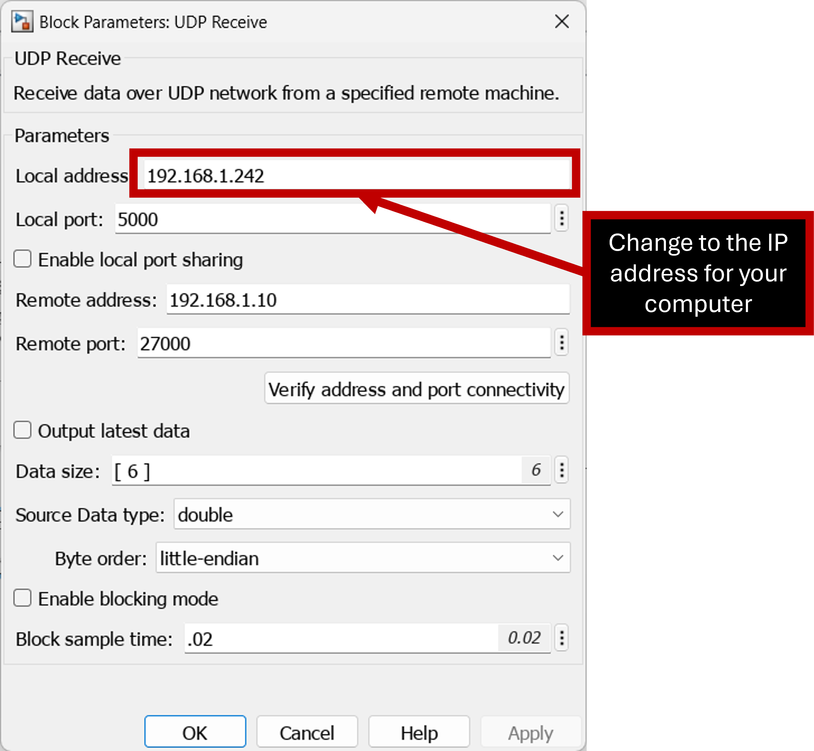
Figure X: INFO 

8. OPTIONAL: Add the Real-Time Sync blocks to your simulation. (This Step is optional – Slows the Receiver Simulink Sim.) 
<!--Picture 1-->
<figure>
  
  <figcaption>Figure 1.     </figcaption>
</figure>
Figure X: INFO 

9. Double Click to set the settings for the Real-Time Synchronization under Simulink Desktop Real-Time Toolbox. – Depending on your application you can adjust the sampling rate of the Real-Time Synchronization. For right now set it is okay to sample at  0.1 seconds, with a maximum missed tick of 50.  
    * (This Step is optional – Slows the Receiver Simulink Sim.) 
<!--Picture 1-->
<figure>
  
  <figcaption>Figure 1.     </figcaption>
</figure>
Figure X: Real-Time Synchronization Block. 

 
10. Run 'sldrtkernel -setup'  in MATLAB to setup Real Time Sync (Only have to do this the first time you use Real-Time Sync) 
    * (This Step is optional – Slows the Receiver Simulink Sim.) 
 <!--Picture 1-->
<figure>
  
  <figcaption>Figure 1.     </figcaption>
</figure>
Figure X: Running sldrtkernel -setup to activate the real-time synchronization 

 

11. Hit run and should receive data ( Rigid body was oscillated in the x-direction ) 
<!--Picture 1-->
<figure>
  
  <figcaption>Figure 1.     </figcaption>
</figure>
Figure X: Data Captured from Remote Computer 


#### Learning Objectives
<div style="color:black; background:lightblue; border: 1px dashed black">

``` 
Objectives: 
1. Download NatNet SDK on Computer 1

2. Download udp_c_comm_matlab_simulink.zip on Computer 1

3. Validate and verify correct settings in the FuncMotive function on Computer 1

4. Update Simulink Sim on Computer 1

5. Create UDP Send in Simulink Sim using Instrument Control Tool Box 

6. Receive Optitrack Data from Motive to Simulink on Computer 1 

7. Broadcast Optitrack Data from Simulink on Computer 1 

8. Create Simulink Model on your Computer with UDP Receive function. 

9. Receive Optitrack data in Simulink on your Computer. 

10. Document and report on all steps as outlined. 
``` 
</div>

<br><!--Paragraph-->
<br><!--Paragraph-->

## 6: EXTRA CREDIT - Using MATLAB Simulink 3D Animation to create a virtual representation of the data from Motive. 

#### Learning Objectives
<div style="color:black; background:lightblue; border: 1px dashed black">

``` 
1. Run through SImulink Tutorials on how to create 3D animation 

2. Insert the Actor and Simulation 3D Scene Configuration Blocks within your simulink model. 

3. Insert an appropriate CAD STL file for your object (ex. Aircraft, Spacecraft, Rocket, Car, etc...) 

4. Link the input for the Actor to the output of the Motive State Data [XYZ, Roll, Pitch, Yaw] 

5. Demonstrate that your model moves, spins, and is tracked. 
``` 
</div>

### 6.1 Information on how to use Simulink 3D 
1. You will need to have the Simulink 3D Animation addon, to check if you have it and to install it click the addons button in MATLAB. 
    * NOTE: Make sure you are connected to the school Wi-fi network to have internet access. 
<!--Picture 1-->
<figure>
  
  <figcaption>Figure 1.     </figcaption>
</figure>
Figure X: AddOn button 

2. Search for Simulink 3D Animation in the addon browser, it is made by MathWorks 
<!--Picture 1-->
<figure>
  
  <figcaption>Figure 1.     </figcaption>
</figure>
Figure X: Simulink 3D Animation AddOn 

3. Once installed, go to the documentation for the addon and go to the get started page and go through the “Create 3D Simulation Using Simulink” documents. 
    * https://www.mathworks.com/help/sl3d/ 
    * https://www.mathworks.com/help/sl3d/create-3d-simulation-using-simulink.html  

4. To open the 3D sim examples, run the command open_system("CreateWorld"); 
   * In MATLAB and click the warning about running it in Simulink. https://www.mathworks.com/help/sl3d/create-world-and-actor-using-simulink.html  
<!--Picture 1-->
<figure>
  
  <figcaption>Figure 1.     </figcaption>
</figure>
Figure X: Using the open_system("CreateWorld"); Command 

5. It is left to the reader to go through the documentation and examples of how to create and simulate virtual objects in Simulink. 

 

### 6.2 Connecting the Motive Data to a 3D simulink example. 

1. Open the example CreateActorFrom3DGraphic. 
    * open_system("CreateActorFrom3DGraphic"); 

2. Copy the Actor and Simulation 3D Scene Configuration Blocks and paste them into the Simulink_UDP Simulink file. 
<!--Picture 1-->
<figure>
  
  <figcaption>Figure 1.     </figcaption>
</figure>
Figure X: Simulink Model with 3D blocks inserted. 

3. Open the Actor Block (Cylinder) and modify variables.  
* Change the variable name of the block as appropriate. 
<!--Picture 1-->
<figure>
  
  <figcaption>Figure 1.     </figcaption>
</figure>
Figure X: Actor Variable Name 

* Go to the Inputs tab and click on browse at the bottom of the white box, then select translation and hit the right arrow. Then select rotation then hit the right arrow 
<!--Picture 1-->
<figure>
  
  <figcaption>Figure 1.     </figcaption>
</figure>
Figure X: Setting Up Actor Inputs 

4. The actor block will now have inputs for translation and rotation. Hook up these inputs. 
    * Set Gains to 1 as inputs are already in meters 
    * Have 2 Mux of 3 inputs each, one for translation and one for rotation 
    * Put a transpose after each Mux, as the Mux creates column vectors and the actor inputs expect row vectors 
    * Insert A gain is needed after. 

5. You should have connection something like this 
    * You may need to mess with gains and switching inputs to get it to work correctly 
    * Inputs are in degrees and you may need to adjust the coordinate frame to account for discontinuity in angle reading. 

 
6. In the Simulation 3D scene block change the scene view to custom and input. 

7. CONNECT TO Space Robotics Lab WIFI ROUTER 

8. Ensure that Data is being streamed and collected. 

9. Load an optional STL file of your actor. For example a CAD of a Rocket, Satellite, Spacecraft, aircraft, or any other STL format CAD file as appropriate. 
    * Replace the createshape with 
    * load(Actor,'Simcraft_Assembly_V3_EVERYTHING_PART.STL', (1/39.8/100)*[1 1 1]); 

10. Your Simulink should now have a visualization of a CAD object that moves with the Motive state data [X,Y,Z, Roll, Pitch, Yaw] 
<!--Picture 1-->
<figure>
  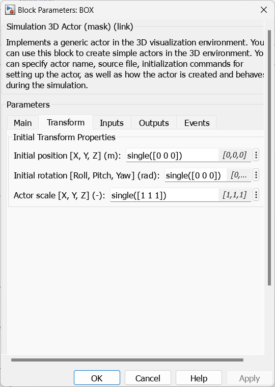
  <figcaption>Figure 1.     </figcaption>
</figure>
 Figure X: Example Virtual Object that Moves with Motive Data. 


#### Learning Objectives
<div style="color:black; background:lightblue; border: 1px dashed black">

``` 
1. Run through SImulink Tutorials on how to create 3D animation 

2. Insert the Actor and Simulation 3D Scene Configuration Blocks within your simulink model. 

3. Insert an appropriate CAD STL file for your object (ex. Aircraft, Spacecraft, Rocket, Car, etc...) 

4. Link the input for the Actor to the output of the Motive State Data [XYZ, Roll, Pitch, Yaw] 

5. Demonstrate that your model moves, spins, and is tracked. 
``` 
</div>

<!--THE END-->

