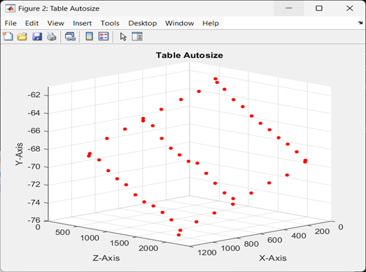
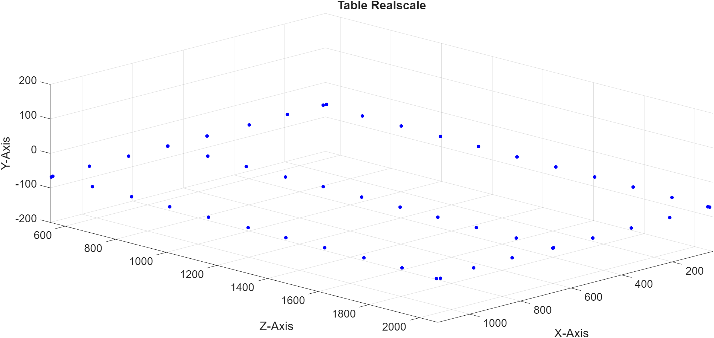
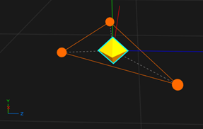
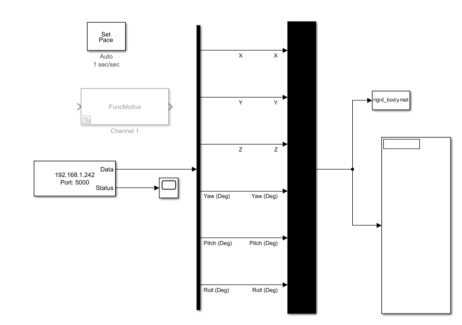
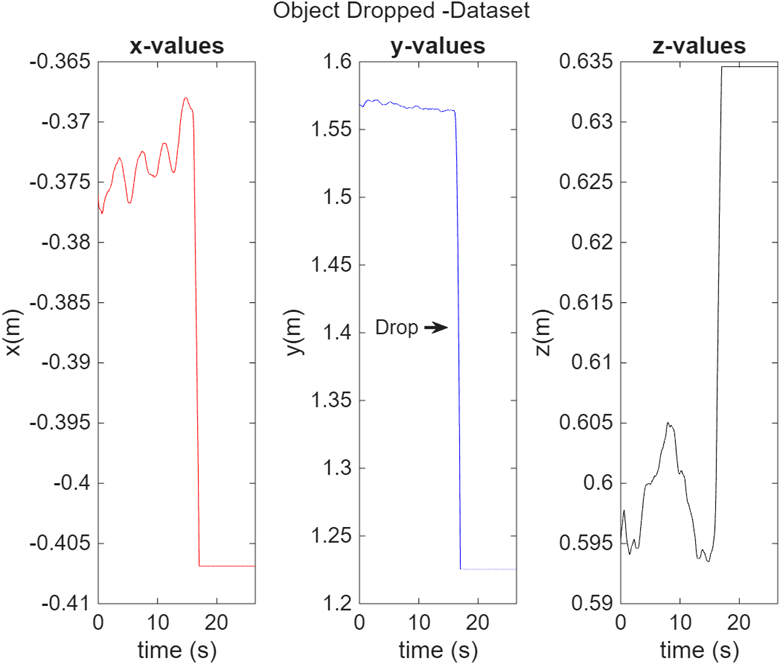
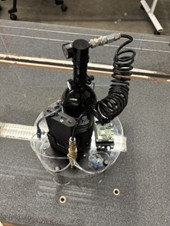
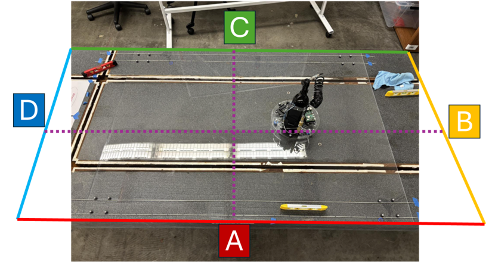
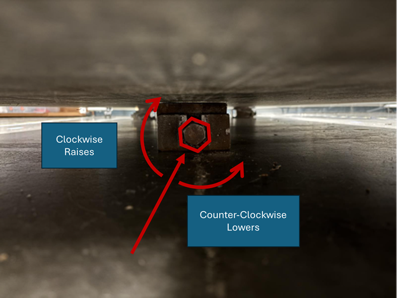
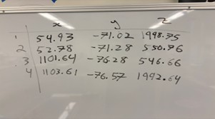
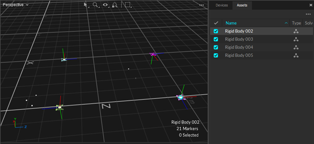

# Lab 2: Granite Table Leveling and Calibration

Authors: 

- Connell Crawford, 
- Alexander Debartolo, 
- Stephen Kwok-Choon

Contact:  skwokcho@calpoly.edu

## Introduction:

The purpose of this lab is to calibrate and level the granite table for experiments in the lab. This is necessary to ensure that air-bearing vehicles can operate on the granite surface without a gravity component causing the vehicle to have a bias in a given direction. (see figure 1)

This experiment outlines a method to determine the slope and level of the table, as well as corrective action necessary to remedy the slope of the table. 

<figure>
  
  <figcaption>Figure 1: Rigid Body Locations to be captured.      </figcaption>
</figure> 

In the following lab we are going to determine the inverse of the gravity vector by performing a drop experiment. Thus, this will allow us to compare the inverse of the gravity vector coordinate frame to the table coordinate frame. Allowing us to determine the level of our granite table (See Figure 2).


<figure align = "center" >
  
  <figcaption align = "center" >Figure 2: Coordinate Frame Comparison of inverse gravity vector to table coordinate frame.      </figcaption>
</figure> 


#### Learning Objectives
<div style="color:black; background:lightblue; border: 1px dashed black">

```
1.	Determine the level of the table using OptiTrack
2.	Determine the normal vertical vector of the room using
    OptiTrack and Simulink.
3.	Determine the offset angle vectors between the granite table
    and normal vector
4.	Calibrate and level table
5.	Document and record all findings within a lab writeup 
    and report.
```
</div>


## 1 Getting Data of The Surface of The Table

#### Learning Objectives
<div style="color:black; background:lightblue; border: 1px dashed black">

```
- Measure and determine the level of the table through OptiTrack
```
</div>


1.	Required Materials
    - More than 128 feet of string.
    - Tape
    - Tape Measure
    - Two Yardsticks
    - Whiteboard Marker
    - Whiteboard
    - Cameras and Motive (Calibrated and Ready - See lab 1)
    - OptiTrack Markers of the same size
        
        NOTE: Grab the markers at their base, so as not to scuff the markers.

<p align="center" width="60%">
    
    <figcaption align = "center" >Figure 3: Optitrack Marker.      </figcaption>
</p>

2.	Startup Computer 1, the cameras, and Motive by reviewing Lab 1: Procedures 1 and 2. 

3.	Place the yardsticks so they are on either side of the width of the granite table. Using the yardsticks string was then fixed at 3inch increments. (See Figure X) The strings act as guide markers to help place the optical tracking markers that shall be used for this experiment.

    a.	Roll out a piece of string that goes from one end of the table to the other

    b.	Tape the string one inch from the edge of the table at both ends

    c.	Cut the string according to the length as shown in Figure 

<figure align = "center" >
  
  <figcaption align = "center" >Figure 4: Yardstick and String Placement.      </figcaption>
</figure>

4.	Repeat Steps 3, but each string should be 3 inches apart until you reach the other side of the table. 

<figure align = "center" >
  
  <figcaption align = "center" >Figure 5: String Layout and Placement at 3 inch intervals.      </figcaption>
</figure>

5.	Mark the string starting at the edge of the glass, then mark every 3 inches on the string.  (see figure X below)

    a.	**<span style="color:red">NOTE</span>** Please avoid marking the table

<figure align = "center" >
  
  <figcaption align = "center" >Figure 6: Student Marking String.      </figcaption>
</figure>

<figure align = "center" >
  
  <figcaption align = "center" >Figure 7: Student marking string at 3 inch intervals.      </figcaption>
</figure>

6.	Repeat for a string in the middle of the table and at the other end of the table. 

<figure align = "center" >
  
  <figcaption align = "center" >Figure 8: String At the Ends of the Table and in The Middle Marked At 3-inch Intervals      </figcaption>
</figure>

7.	Place OptiTrack markers 3-inches apart using the strings as reference. First go lengthwise in 2 rows like in Figure X.

    a.	NOTE: Grab the markers at their base, so as not to scuff the markers.

    b.	Place all the markers on the same side of the screen so the data is more consistent.

8.	On Computer 1 in Motive Remove any existing Rigid Bodies.
9.	Create several square Rigid Bodies with 4 markers each. 

<figure align = "center" >
  
  <figcaption align = "center" >Figure 9: Visualization of the rigid body objects created by the markers      </figcaption>
</figure>

<figure align = "center" >
  
  <figcaption align = "center" >Figure 10: Rigid Body Objects visualized in Motive Software      </figcaption>
</figure>

10.	Record each X/Y/Z values of every Rigid Body you created on the White Board.

    a.	NOTE: Make sure you are getting the values from the center of the Rigid Body (the diamond in the middle) and not the points.

    b.	It is best to record the Rigid Bodies from one side of the table to the other, as it makes it easier to spot changes in height values in the matrixes. (And it looks nicer and can spot errors better)

<figure align = "center" >
  
  <figcaption align = "center" >Figure 11: Data Collection on Whiteboard      </figcaption>
</figure>

11.	Move the markers along the table as outlined in Figure X below.

    a.	Repeat steps 7-10
    
    b.	Collect and record data to determine the measured level of the granite table (see Figure X and X below for example markers points to collect and track.)
    
    c.	At a minimum, collect the following Rigid Body information in order to characterize the table.
    
    d.	After all data has been collected. You should have a table of X, Y, and Z data for processing as shown in Figure X below.


<figure align = "center" >
  
  <figcaption align = "center" >Figure 12: All Rigid Body Locations to be tracked.      </figcaption>
</figure> 


#### Summary of Learning Objectives
<div style="color:black; background:lightblue; border: 1px dashed black">

```
- Measure and determine the level of the table through OptiTrack
```
</div>

## 2: Analyze Data in MATLAB

#### Summary of Learning Objectives
<div style="color:black; background:lightblue; border: 1px dashed black">

```
Objectives:
 
1 Determine the level of the granite table from Optitrack Data collected. 
2 Determine the normal vertical vector (gravity vector) of the room using OptiTrack and Simulink. 
3 Determine the offset angle vectors between the granite table and gravity vector
```
</div>


### 2.1. Determine the level of the granite table from Optitrack Data

1.	Transfer the Data to MATLAB    
    a.	readmatrix from Excel file
    
    b.	Import Data Button

2.	Calculate max difference in height (Delta Y)

3.	Create a 3D Scatter plot to visualize the current level of the table.

    a.	<code>Scatter3()</code> – Matlab Command

    b.	View the plot in isometric view and include the figure within your report using the View – Matlab command

    c.	NOTE: MATLAB has the vertical axis as Z, while the data has the vertical axis in Y. You will have to swap the Y and Z datasets for visualization purposes.

<figure align = "center" >
  
  <figcaption align = "center" >Figure 12: Scatter visualization using Matlab of Table recorded values.      </figcaption>
</figure> 


4.	Create a 3D Scatter plot showing actual shape of table using the axis equal command when plotting the scatter plot
    a.	<code>axis equal;</code>
    b.	Also use the <code> zlim </code> command for example <code> zlim([-200,200]) </code> to make sure that Y-axis is shown.

<figure align = "center" >
  
  <figcaption align = "center" >Figure 13: Example Table Visualization with the axis equal command and z limit implemented that allows you to see the Y-axis.      </figcaption>
</figure> 

### 2.2: Determine the gravity vector using OptiTrack and Simulink.

The premise of this experiment is to drop a rigid body object that is tracked by the Optitrack Motive software with data collected in Matlab|Simulink. This shall be accomplished utilizing the MATLAB|Simulink model that the students developed from Lab 1 to collect data of the rigid body. 

Three rigid body drop experiments shall be performed and an average taken in order to determine the gravity vector.

1.	As part of the process to level the granite table. We need to determine the gravity vector to find and compare the table normal plane to the gravity normal plane. To do this we create a rigid body object using Optitrack. Materials Needed:

    a.	A Rigid Body that can be dropped (such as a carboard box)
        
        With OptiTrack markers placed on it as shown in Figure X.

    b.	OptiTract Cameras - Software

    c.	Motive – Software with Streaming enabled.

    d.	Simulink – With data capture enabled to a .mat file.

  <p align="center">
    
    &nbsp; &nbsp; &nbsp;
    
  </p>
    <figcaption align = "center" > Figure 14: Rigid Body Object (LEFT), Cardboard Box Object (RIGHT) </figcaption>

2.	Setup Motive and the Rigid body (See Lab 1 for a review of how to do so.)
    
    a.	Set up Rigid Body
    
    b.	Set up Broadcasting

3.	Setup Simulink to capture data (See Lab 1 for a review of how to do so.)

    a.	Use a To File block and save the data for each run to for example a <code>mat</code> file called <code>rigid_body.mat</code> . This will save all input data into the <code>mat</code> file that can be post-processed in MATLAB.

<figure align = "center" >
  
  <figcaption align = "center" >Figure 15: Example Table Visualization with the axis equal command and z limit implemented that allows you to see the Y-axis.      </figcaption>
</figure> 

4.	Run Simulink and perform the drop test. Please Review before performing experiment.

    a.	Student A shall hold the rigid body at a fixed height above the floor.
  
    b.	Student A needs to ensure that they do not obstruct the angles of sight of the optitrack markers.
  
    c.	Student B needs to be at the Computer 1 terminal.
  
    d.	Student B starts the Matlab|Simulink Data Streaming.
  
    e.	Student C starts the recording and ensures the connection is stable on their laptop.

    f.	Student B shall wait 5-10 seconds then provide a countdown to student A to release the rigid body object.
    
    g.	At the end of the verbal countdown [5,4,3,2,1] - Student A releases the rigid body object with no spin and no horizontal bias, thus the rigid body should fall straight down to the floor. Allowing us to capture the gravity unit vector.
    
    h.	As soon as the rigid body hits the floor, Student C should stop data recording and save the run as  rigid_body_run_X.mat replace X as run [1,2, 3]. If you are satisfied with the data, rename the file/s so it does not get overwritten

5.	Repeat Step 4 until you have 3 sets of data.

### 2.3: Determine the granite table plane and gravity vector normal plane

1.	Graph the drop data from each test to find out what section of the data is part of the drop test. If student A, B, and C are coordinated. You should have data that looks like this (see figure 16) - Include this figure in your report.

    a.	NOTE: Motive uses the Y-Value as the vertical vector

<figure align = "center" >
  
  <figcaption align = "center" >Figure 16: Example Drop Test Dataset      </figcaption>
</figure> 

2.	Trim the data from the drop test to just the segment after release and before impact with the ground.

    a.	NOTE: Each drop test will have different start and end times that needs to be trimmed (see Figure X as an example from one drop test experiment)


<figure align = "center" >
  
  <figcaption align = "center" >Figure 17: Trimmed Drop Test Dataset      </figcaption>
</figure>

3.	Use the drop data to determine the gravity vector as indicated in Figure 17 a timeslice was taken of the drop data that was used to determine the gravity vector.

    a.	Create the gravity vector from the start and end points.

4.	Inverse the gravity vector to make the vector point vertically upwards.

5.	Convert gravity vector to a unit vector.

6.	Repeat Steps 1-5 for the other data runs.

7.	Average the three gravity unit vectors.

8.	Plot the normal plane of gravity vector – this example code works for Matlab 2024b version or later. A similar code can be created in earlier versions of Matlab –however students may need to explore how to do so. 

<div style="color:black; background:lightyellow; border: 1px dashed black">

```
  % vector start and end points
  % annotation of the unit normal vector
  % with the base at [0,0,0]

  normal = [0 0 0; b_unit(1) b_unit(3) b_unit(2)];

  % graph plane - conditions to create the plane

  constantplane(normal,-100);

  % change view limits to show plane

    xlim([0 2000]);
    ylim([0 2000]);
    zlim([-500 500]);
```
</div>


9.	On the same figure graph the Granite Table plane from the data points collected for the table can be graphed.

  **<span style="color:red">NOTE:</span>** It is important to note that the OptiTrack system and Global Coordinate Frame that we are collecting data was calibrated to the surface of the table. Hence, the table plane is offset with respect to the gravity plane. The gravity plane is the desired level that we want to calibrate towards. Example code that can be used to create the mesh graph for the table.


#### Example Code to create a mesh surface

<div style="color:black; background:lightyellow; border: 1px dashed black">

```
    [xq,yq] = meshgrid(0:100:2000, 0:100:2000);
        
        vq = griddata(dataX,dataZ,dataY,xq,yq); 
        
        %(x,y,v) being your original data for plotting points

      mesh(xq,yq,vq);

      hold on;

      plot3(dataX,dataZ,dataY,'o');
```
</div>

<figure align = "center" >
  
  <figcaption align = "center" >Figure 18: Comparing Gravity and Granite Table Planes </figcaption>
</figure>

### 2.4 Determine the offset angle vectors 

1.	Calculate and determination of Azimuth and Elevation angles of the gravity vector with respect to the Optitrack Coordinate Frame. [5 points]

2.	Include your findings, equations, results, and Matlab or Python Code that you used to Determine the Azimuth and Elevation Angles of the offset angle vectors between the granite table plane and the gravity vector. [10 points]

### 2.5 Extra CREDIT - Optional

3.	Discuss and Present the Rotation Matrix to rotate from the granite table coordinate frame to the gravity vector coordinate frame. [10 points]


## 3: Calibration and Leveling the Granite Table.

#### Learning Objectives:

<div style="color:black; background:lightblue; border: 1px dashed black">

```
    1. Calibrate and level table.
    2. Document and record all findings within a lab writeup and report.
```
</div>

### 3.1: Adjust the Jacks on the granite table to make it level 

To determine how much each jack should be adjusted - we are going to use a Floating Spacecraft Simulator testbed. (https://irp.cdn-website.com/4fbb675e/files/uploaded/Federal-Spec-GGG-P-463c.1.pdf )

<figure align = "center" >
  
  <figcaption align = "center" >Figure 19: Jack Placement for Granite Table (https://irp.cdn-website.com/4fbb675e/files/uploaded/Federal-Spec-GGG-P-463c.1.pdf ) </figcaption>
</figure>

1.	Additional Materials Needed:

    a.	Air bearing vehicle that can passively float on the granite table.

<figure>
  <p  align="center" width="100%">
  
  <figcaption align = "center" >Figure 20: Floating Spacecraft Simulator (FSS) air-bearing platform </figcaption>
  </p>
</figure>


2.	Place the Air bearing vehicle on the table and turn it on to determine how slanted the granite table is.

3.	Adjust the Width direction to remove the A-side and C-side Bias of the table first. The Bias can be experimentally validated by turning on the compressed air of the air-bearing vehicle and seeing which side the vehicle shall slide towards. 

    a.	**<span style="color:red">NOTE:</span>**: When performing this experiment make sure that the air-bearing vehicle does not fall off the table.

    b.	Turn off the Air bearing vehicle during each adjustment to conserve on compressed air.

    c.	Adjust the jacks on the granite table to correct the bias
      
      After resolving the bias in the A and C direction, then resolve the bias in the B and D direction. This can be done by adjusting the jack closest to the D-side.

      NOTE: There are two sizes of bolts used for the jacks, make sure you are using the right size – Clockwise Raises the Jack, Anti-Clockwise Lowers the Jack 

<figure>
  <p  align="center" width="100%">
  
  <figcaption align = "center" >Figure 21: Table Calibration Methodology </figcaption>
  </p>
</figure>


<figure align = "center" >
  
  <figcaption align = "center" >Figure 22 : Wrench to Adjust Table Jacks </figcaption>
</figure>

<figure align = "center" >
  
  <figcaption align = "center" >Figure 23: Method to Adjust Jacks </figcaption>
</figure>

4.	Repeat steps 2-4 until the table has been leveled with the air-bearing vehicle stable and showing a minimal to no bias to slide due to gravity.

5.	Retake data from the 4 corners of the table and compare it to the gravity plane to verify if the adjusted table orientation is now closer to level (compare if closer to parallel to the gravity normal plane).  

<figure align = "center" >
  
  <figcaption align = "center" >Figure 24: Example Dataset from rigid body objects at the Table Corners </figcaption>
</figure>

<figure align = "center" >
  
  <figcaption  align = "center" >Figure 25: Motive - Granite Table with Markers </figcaption>
</figure>

Figure 26 shows a comparison of the granite table BEFORE adjustment as compared to the gravity vector normal plane.

<figure align = "center" >
  
  <figcaption align = "center" >Figure 26: Granite Table BEFORE Adjustment </figcaption>
  </p>
</figure>

Figure 27 shows a comparison of the granite table AFTER adjustment as compared to the gravity vector normal plane.

<figure align = "center" >
  
  <figcaption align = "center" >Figure 27: Granite Table AFTER Adjustment </figcaption>
  </p>
</figure>

#### Summary of Objectives:
<div style="color:black; background:lightblue; border: 1px dashed black">

```
    1. Determine the normal vertical vector of the room using OptiTrack and Simulink.
    2. Determine the offset angle vectors between the granite table and normal vector

```
</div>


 

