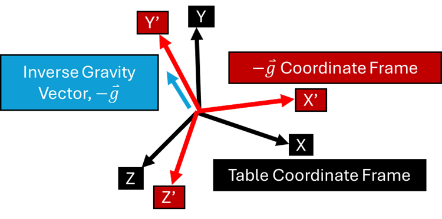
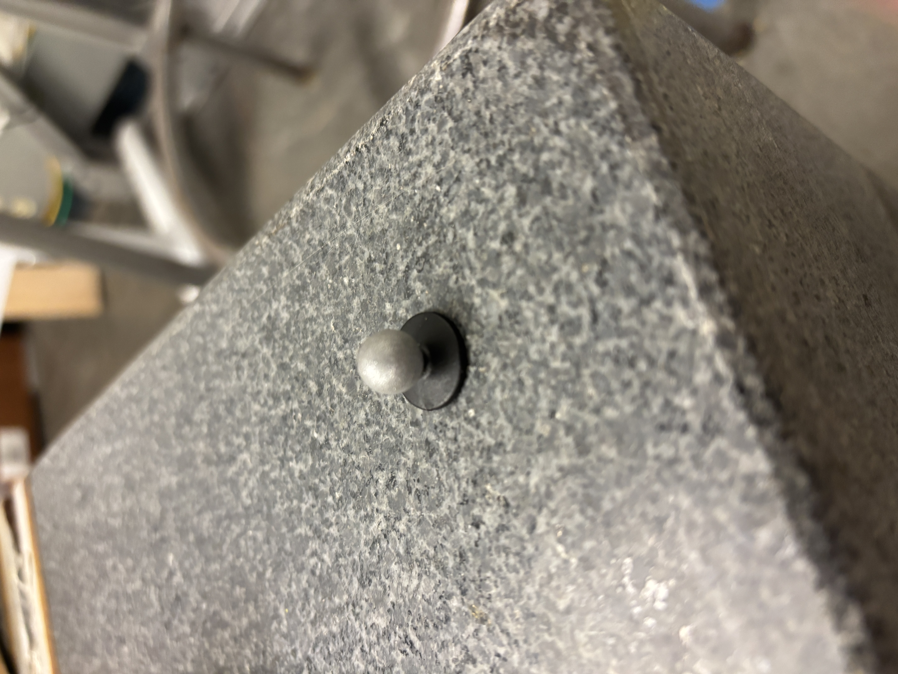
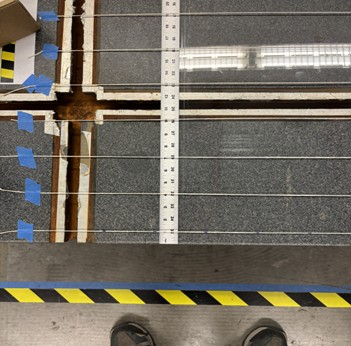
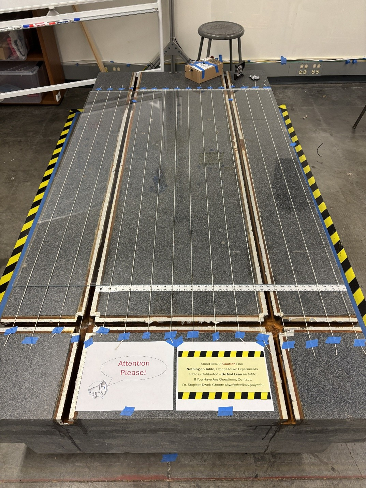
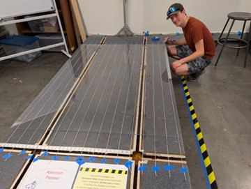
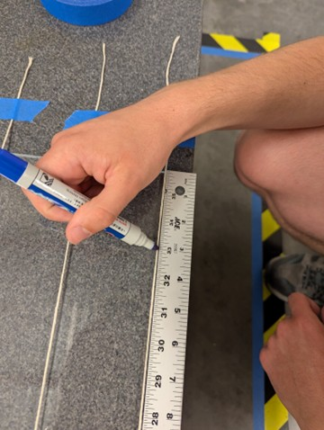
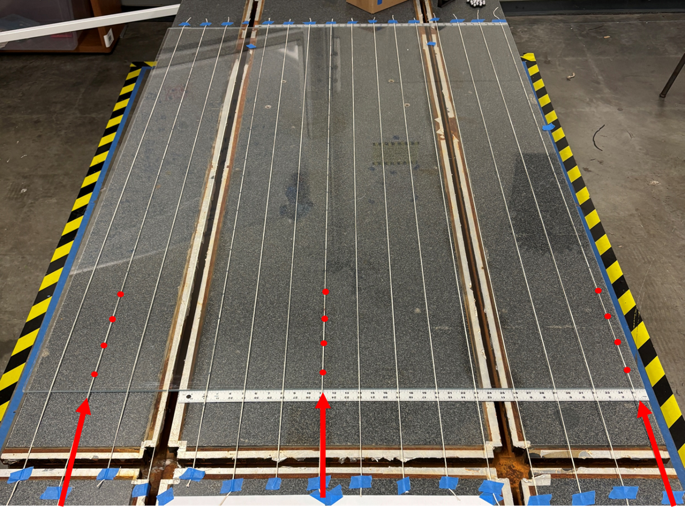
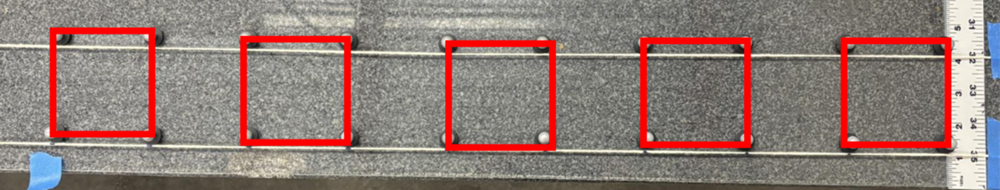
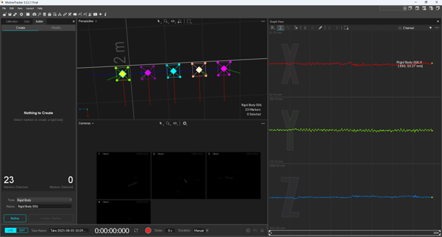
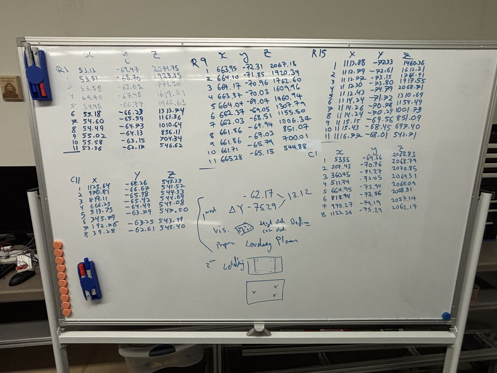

# Lab 2: Granite Table Leveling and Calibration

Authors: 

- Connell Crawford, 
- Alexander Debartolo, 
- Stephen Kwok-Choon

## Introduction:


The purpose of this lab is to calibrate and level the granite table for experiments in the lab. This is necessary to ensure that air-bearing vehicles can operate on the granite surface without a gravity component causing the vehicle to have a bias in a given direction. (see figure 1)

This experiment outlines a method to determine the slope and level of the table, as well as corrective action necessary to remedy the slope of the table. 

<figure>
  
  <figcaption>Figure 1: Rigid Body Locations to be captured.      </figcaption>
</figure> 

In the following lab we are going to determine the inverse of the gravity vector by performing a drop experiment. Thus, this will allow us to compare the inverse of the gravity vector coordinate frame to the table coordinate frame. Allowing us to determine the level of our granite table (See Figure 2).


<figure>
  
  <figcaption>Figure 2: Coordinate Frame Comparison of inverse gravity vector to table coordinate frame.      </figcaption>
</figure> 


#### Learning Objectives
<div style="color:black; background:lightblue; border: 1px dashed black">

```
1.	Determine the level of the table using OptiTrack
2.	Determine the normal vertical vector of the room using
    OptiTrack and Simulink.
3.	Determine the offset angle vectors between the granite table
    and normal vector
4.	Calibrate and level table
5.	Document and record all findings within a lab writeup 
    and report.
```
</div>


## 1 Getting Data of The Surface of The Table

#### Learning Objectives
<div style="color:black; background:lightblue; border: 1px dashed black">

```
- Measure and determine the level of the table through OptiTrack
```
</div>


1.	Required Materials
    - More than 128 feet of string.
    - Tape
    - Tape Measure
    - Two Yardsticks
    - Whiteboard Marker
    - Whiteboard
    - Cameras and Motive (Calibrated and Ready - See lab 1)
    - OptiTrack Markers of the same size
        
        NOTE: Grab the markers at their base, so as not to scuff the markers.

<p align="center" width="60%">
    
    <figcaption>Figure 3: Optitrack Marker.      </figcaption>
</p>

2.	Startup Computer 1, the cameras, and Motive by reviewing Lab 1: Procedures 1 and 2. 

3.	Place the yardsticks so they are on either side of the width of the granite table. Using the yardsticks string was then fixed at 3inch increments. (See Figure X) The strings act as guide markers to help place the optical tracking markers that shall be used for this experiment.

    a.	Roll out a piece of string that goes from one end of the table to the other

    b.	Tape the string one inch from the edge of the table at both ends

    c.	Cut the string according to the length as shown in Figure 

<figure>
  
  <figcaption>Figure 4: Yardstick and String Placement.      </figcaption>
</figure>

4.	Repeat Steps 3, but each string should be 3 inches apart until you reach the other side of the table. 

<figure>
  
  <figcaption>Figure 5: String Layout and Placement at 3 inch intervals.      </figcaption>
</figure>

5.	Mark the string starting at the edge of the glass, then mark every 3 inches on the string.  (see figure X below)

    a.	<span style="color:red">NOTE</span> Please avoid marking the table

<figure>
  
  <figcaption>Figure 6: Student Marking String.      </figcaption>
</figure>

<figure>
  
  <figcaption>Figure 7: Student marking string at 3 inch intervals.      </figcaption>
</figure>

6.	Repeat for a string in the middle of the table and at the other end of the table. 

<figure>
  
  <figcaption>Figure 8: String At the Ends of the Table and in The Middle Marked At 3-inch Intervals      </figcaption>
</figure>

7.	Place OptiTrack markers 3-inches apart using the strings as reference. First go lengthwise in 2 rows like in Figure X.

    a.	NOTE: Grab the markers at their base, so as not to scuff the markers.

    b.	Place all the markers on the same side of the screen so the data is more consistent.

8.	On Computer 1 in Motive Remove any existing Rigid Bodies.
9.	Create several square Rigid Bodies with 4 markers each. 

<figure>
  
  <figcaption>Figure 9: Visualization of the rigid body objects created by the markers      </figcaption>
</figure>

<figure>
  
  <figcaption>Figure 10: Rigid Body Objects visualized in Motive Software      </figcaption>
</figure>

10.	Record each X/Y/Z values of every Rigid Body you created on the White Board.

    a.	NOTE: Make sure you are getting the values from the center of the Rigid Body (the diamond in the middle) and not the points.

    b.	It is best to record the Rigid Bodies from one side of the table to the other, as it makes it easier to spot changes in height values in the matrixes. (And it looks nicer and can spot errors better)

<figure>
  
  <figcaption>Figure 11: Data Collection on Whiteboard      </figcaption>
</figure>

11.	Move the markers along the table as outlined in Figure X below.

    a.	Repeat steps 7-10
    
    b.	Collect and record data to determine the measured level of the granite table (see Figure X and X below for example markers points to collect and track.)
    
    c.	At a minimum, collect the following Rigid Body information in order to characterize the table.
    
    d.	After all data has been collected. You should have a table of X, Y, and Z data for processing as shown in Figure X below.


<figure>
  
  <figcaption>Figure 12: All Rigid Body Locations to be tracked.      </figcaption>
</figure> 


#### Summary of Learning Objectives
<div style="color:black; background:lightblue; border: 1px dashed black">

```
- Measure and determine the level of the table through OptiTrack
```
</div>

## 2: Analyze Data in MATLAB

#### Summary of Learning Objectives
<div style="color:black; background:lightblue; border: 1px dashed black">

```
Objectives:
 
1 Determine the level of the granite table from Optitrack Data collected. 
2 Determine the normal vertical vector (gravity vector) of the room using OptiTrack and Simulink. 
3 Determine the offset angle vectors between the granite table and gravity vector
```
</div>