# Lab 3: Characterization of an Air-Bearing Vehicle and Multi-Body system with Motive and Matlab|Simulink 

Authors:

Connell Crawford, 

Alexander Debartolo,

Stephen Kwok-Choon

## Introduction -- This section needs a bit of attention. 

How to measure rotation: 

* Euler Angles: 

    * Pitch, Yaw, Roll  

    * Rotation X, Rotation Y, Rotation Z 

    * phi, theta, psi 

<!--Picture 1-->
<figure align = "center">
  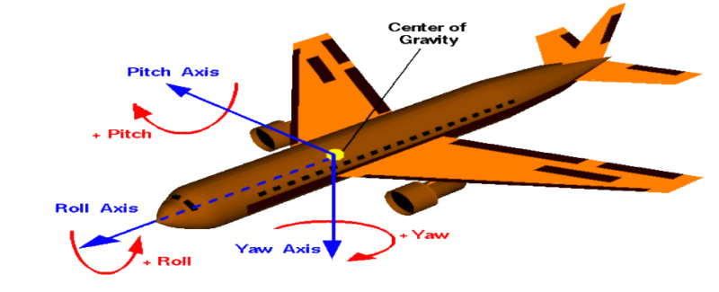
 <figcaption align = "center">Figure X: https://www.infohas.ma/en/aircraft-stability-and-control/       </figcaption>
  </p>
</figure>
<!--Picture 2-->
<figure align = "center">
  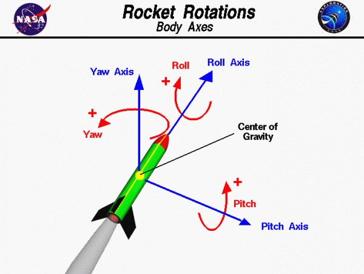
 <figcaption align = "center">Figure X: From NASA https://www1.grc.nasa.gov/beginners-guide-to-aeronautics/rocket-rotations/       </figcaption>
  </p>
</figure>
<!--Picture 1-->
<figure align = "center">
  
 <figcaption align = "center">Figure X: From NASA page 15 of PDF page 9 of labeled pages https://ntrs.nasa.gov/api/citations/19650019695/downloads/19650019695.pdf       </figcaption>
  </p>
</figure>

* Quaternions: 

    * w, x, y, z 

<br><!--Paragraph-->
<br><!--Paragraph-->
<br><!--Paragraph-->

## 1: Learning Objectives

<div style="color:black; background:lightblue; border: 1px dashed black">

``` 
Translation: Collect Data of three translation runs 

    A. XZ plots of translation of the air-bearing vehicle over the three data runs. 

    B. Z-displacement and X-displacement versus time plots 

Rotation: Collect Data of three rotation runs 

    A. Y-rotation (otherwise referred to as theta or yaw) of all rotation data runs. 

    B. Choose one rotation experiment and graph the change with time of  [phi, theta, psi] data 

    C. Convert Euler data to Quaternions and graph the quaternion data array of one run. 
``` 
</div>
 
<br><!--Paragraph-->
<br><!--Paragraph-->
<br><!--Paragraph-->

## 2: Characterization of an Air-Bearing Vehicle and Multi-Body system with Motive and Matlab|Simulink 

The objective of this lab is to collect and process data from a passive air-bearing vehicle that experiences an induced translation and rotation respectively. Students are requested to create plots of linear and angular position, velocity and acceleration. Students are also requested to This also includes the post-processing of data to reduce noise 

### 2.1  Setting up and operating the Air-Bearing Vehicle 

The Floating Spacecraft Simulator (FSS) is comprised of a pneumatic system that consists of an air tank, air regulator, pressure manifold, three air-bearing pads. As well as a raspberry-pi and Arduino R3 Uno that can be connected to on-board sensors. [See figure X below for major components described.] 
<!--Picture 1-->
<figure align = "center">
  
 <figcaption align = "center">Figure X: Air-bearing Vehicle Components Labeled       </figcaption>
  </p>
</figure>
<!--Picture 2-->
<figure align = "center">
  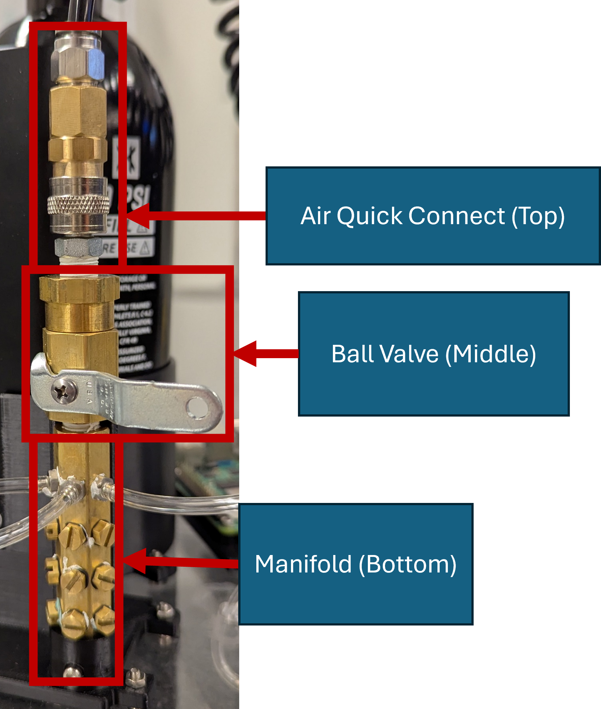
 <figcaption align = "center">Figure X: Air-bearing Vehicle Air Distribution System      </figcaption>
  </p>
</figure>

1. Check to make sure there is enough Air in the bottle >1500 psi. If there is not enough air, take the bottle out and refill it or replace it with a filled one. If it is not possible to remove the air tank, take the whole vehicle over to be refilled.  

        a. YOU WILL NEED AN INSTRUCTER TO HELP YOU FILL AN AIRTANK. 

        b. Talk with the Instructor and Refer to the Air Safety Manuel (To be provided). 

2. Moving the air-bearing vehicle: When moving the air bearing vehicle make sure the air-bearing pads are not damaged, and make sure that the bottom of the pads does not touch anything other than the glass surface. The air bearing pads need to remain undamaged and clean otherwise they may not work properly and develop drag.  When moving the air bearing vehicle: 

        a. Make sure the pads do not hit anything. The smaller pads are only attached via gravity, so when lifting the vehicle they will fall off.  

        b. Ensure that the pads only touch the glass/perspex surface on the granite table. This is so they remain undamaged and clean, so they remain frictionless.  

NOTE: The base of each air-bearing pad is made from porous graphite that allows a constant stream of air to be emitted. To ensure their functionality, do not touch the graphite surface. So that they remain clean and frictionless.  

3. Placing down the air-bearing vehicle:  

        a. When placing the air-bearing vehicle on the granite table, make sure that all the air-bearing are placed down properly with the bottom of them on the table and that the ball joints on the vehicle go into the sockets on all the air-bearings.  

        b. When placing the air-bearing vehicle NOT on the granite table, make sure the bottoms of all the air-bearings are not placed against anything. You will need to place the air-bearing vehicle on elevated blocks.  

### 2.2: Translation Experiment 

Steps to track and record the Floating Spacecraft Simulator (FSS) through a series of translation experiments. 

#### Learning Objectives

<div style="color:black; background:lightblue; border: 1px dashed black">

``` 
Three Translation Experiment runs 

Graphing and processing of data into plots using software such as python or Matlab. 
``` 
</div>


1. Set up the air-bearing vehicle (refer to Part 1). 

2. Set up Motive (refer to Lab 1). 

        a. Set up Rigid Body 

        b. Set up broadcasting 

3. Set up data transmission from Computer 1 to Student A’s computer . 

        a. Data being sent via Simulink. 

        b. Set to run, then make sure you are receiving on Student A’s computer. 

4. Set up data collection in MATLAB|Simulink (refer to Lab 1) on Student A’s computer. 

        a. Verify that data is being gathered by Student A’s computer 

        b. Verify that data being gathered makes sense and is the same data being transmitted by Computer 1. 

        c. Verify data is being saved on Student A’s computer. 

        d. Verify Student A’s computer is recording data at a fast rate and isn't super slow.  

5. Assign Tasks to each student in the group 

        a. Student A will be saving the data and renaming it so it does not get overwritten  

        b. Student B will be at the long end of the table and be pushing the air-bearing vehicle in a straight line. 

        c. Student C be on the other end of the table from Student B and catching the air-bearing vehicle so that it doesn't fall off the table or hit anything (such as the boarder of the table). 

6. Student B will start a countdown from 5 to 0. 

7. At 3 Student A will start recording data on there computer. 

8. At 0 Student B will push the air-bearing vehicle in a straight line with no rotation (or as close as possible). 

9. Student C will catch the air-bearing vehicle on the other side of the table. 

10. After Student C has caught the air-bearing vehicle, Student A will wait a couple of seconds before stopping Simulink, saving the data 

11. Student A will then go rename the data that was just taken to translation_experiment_X (With X being replaced by the run number) 

        a. Save the data so that it does not get overridden when doing another run. 

12. Reset and repeat the experiment for as many runs as needed.  

NOTE: Check the amount of air left before each run of the experiment to make sure there is enough air to perform the experiment. If the air-tank is below 500 psi, it is advisable to refill the air-tank.
 
### 2.3: Rotation Experiment 

#### Learning Objectives

<div style="color:black; background:lightblue; border: 1px dashed black">

``` 
Three Rotation Experiment runs 

Graphing and processing of data into plots using software such as python or Matlab. 
``` 
</div>

Steps to track and record the Floating Spacecraft Simulator (FSS) through a series of rotation experiments.  

1. Perform the same steps as in Part 2, but instead... 

        a. Spin the vehicle in the middle of the table.  

        b. Do all rotation experiments in the same direction. 

        c. Save the files as rotation_experiment_X. (With X being replaced by the run number.) 

### 2.4: Analysis of Translation and Rotation Experiments 

#### Learning Objectives

<div style="color:black; background:lightblue; border: 1px dashed black">

``` 
Translation: Collect Data of three translation runs 

    a. XZ plots of translation of the air-bearing vehicle over the three data runs. 

    b. Z-displacement and X-displacement versus time plots 

Rotation: Collect Data of three rotation runs 

    a. Y-rotation (otherwise referred to as theta or yaw) of all rotation data runs. 

    b. Choose one rotation experiment and graph the change with time of  [phi, theta, psi] data 

    c. Convert Euler data to Quaternions and graph the quaternion data array of one run. 
``` 
</div>


### 2.4.1: Translation Experiments Analysis 

1. Apply filters if necessary – this is based on the quality and noise within the datasets. 

2. Graph the Translation Experiments on the XZ plane to show the trajectory path taken on the table. 

3. Graph one run of the Translation Experiments in the X, Z versus time(s) and display bearing of the vehicle (see figure X below).  
<!--Picture 1 and 2-->
  <p align="center">
    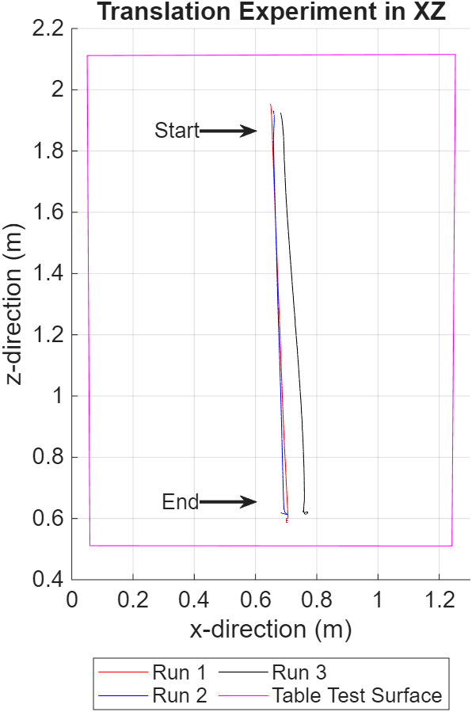
    &nbsp; &nbsp; &nbsp;
    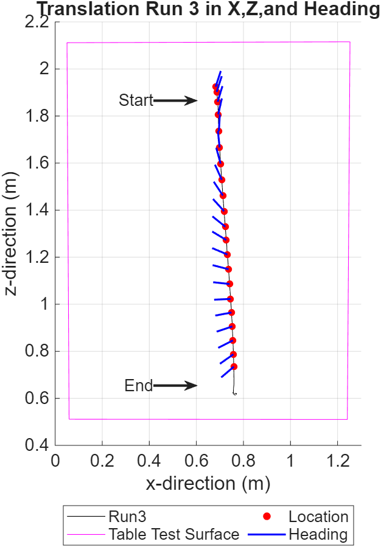
  </p>
  <p align = "center">
    <caption> Figure X: Path trajectories of three translation experiments.  </figcaption>
  </p>

4. Graph the Translation Experiments in the z-direction over time to show the dx/dt slope of the tracked position. 
<!--Picture 1-->
<figure align = "center">
  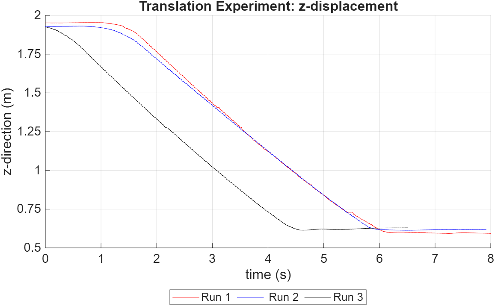
 <figcaption align = "center">Figure X: Translation Experiment – z-displacement      </figcaption>
  </p>
</figure>

5. Graph the Translation Experiments in the x-direction over time. 
<!--Picture 1-->
<figure align = "center">
  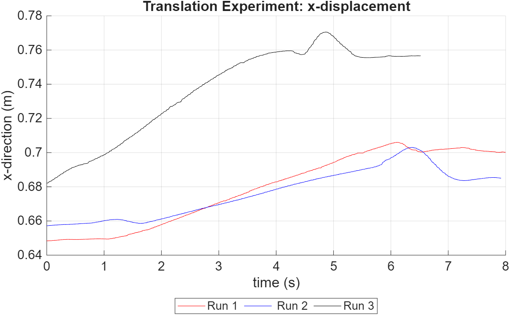
 <figcaption align = "center">Figure X: Translation Experiment – x displacement dataset     </figcaption>
  </p>
</figure>

### 2.4.2: Rotation Experiments Analysis 

1. Apply filters if necessary to the data 

2. Graph the rotation experiments in theta. An Example plot of the rotation dataset 
<!--Picture 1-->
<figure align = "center">
  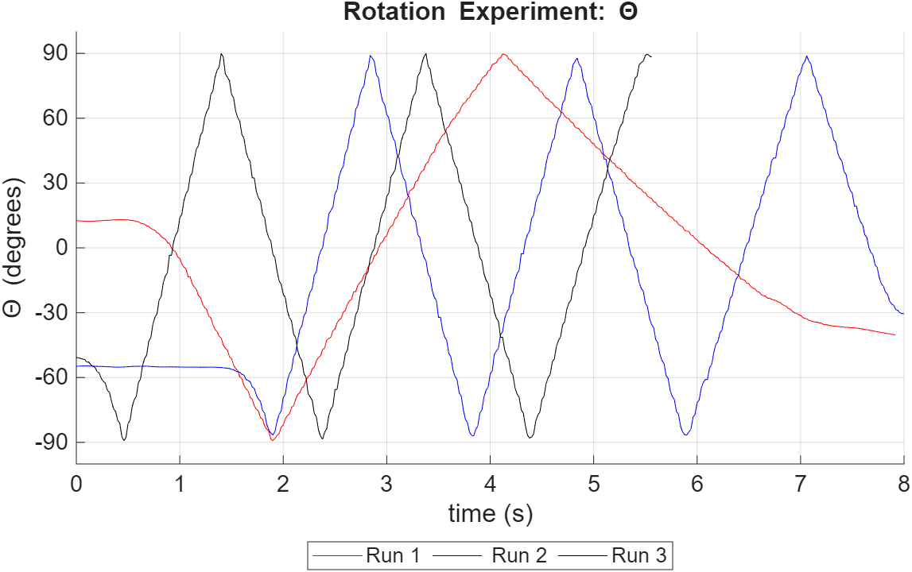
 <figcaption align = "center">Figure X: Example rotation of three runs of y-rotation, theta, heading.       </figcaption>
  </p>
</figure>

3. Graph all the rotation data from one experiment run. 

        a. In your plot please note any interesting observations such as jumps at ±180 degrees, 0 degrees, and/or an inflection at ± 90 degrees for your angles [phi, theta, psi].  
<!--Picture 1-->
<figure align = "center">
  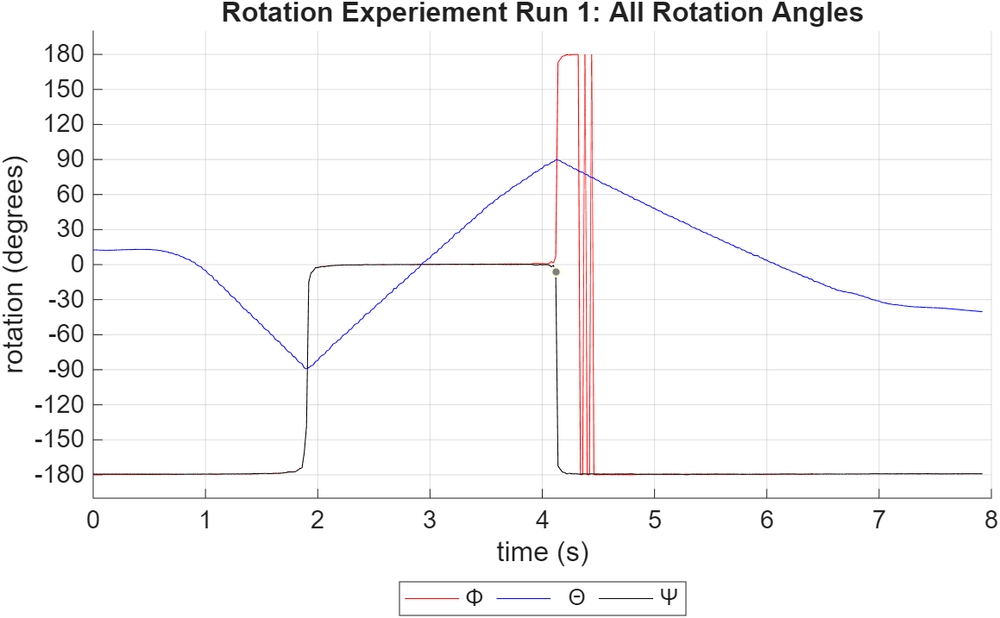
 <figcaption align = "center">Figure X: Example Rotation Data from One Experiment       </figcaption>
  </p>
</figure> 

4. To reduce angle ambiguity and angle discontinuity, most aerospace applications utilize quaternions to determine the orientation of their system. It is requested for you to take your Euler angle data and convert that data into quaternion arrays. Please plot and describe whether your quaternion graphs. 

#### Summary of Learning Objectives

<div style="color:black; background:lightblue; border: 1px dashed black">

``` 
Translation: Collect Data of three translation runs 

    a. XZ plots of translation of the air-bearing vehicle over the three data runs. 

    b. Z-displacement and X-displacement versus time plots 

Rotation: Collect Data of three rotation runs 

    a. Y-rotation (otherwise referred to as theta or yaw) of all rotation data runs. 

    b. Choose one rotation experiment and graph the change with time of  [phi, theta, psi] data 

    c. Convert Euler data to Quaternions and graph the quaternion data array of one run. 
``` 
</div>

<br><!--Paragraph-->
<br><!--Paragraph-->
<br><!--Paragraph-->

## 3. Tracking and Recording of a Multi Rigid Body System through Motive and Matlab|Simulink 

The objective of this part is to guide the students through the process of setting up the tracking and recording settings to allow the tracking and recording of a multi-rigid body system through Motive and Matlab|Simulink. 

### 3.1 Reconfiguring Motive software for Multiple Rigid Bodies 

1. On Computer 1 in Motive create the additional rigid bodies you are going to track. (refer to Lab 1) 

        a. Create two rigid body objects. 
<!--Picture 1-->
<figure align = "center">
  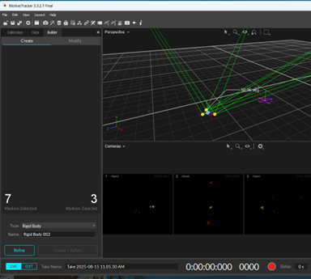
 <figcaption align = "center">Figure X: Make two rigid body objects.       </figcaption>
  </p>
</figure>

        b. Observe both rigid body objects in Motive 
<!--Picture 1-->
<figure align = "center">
  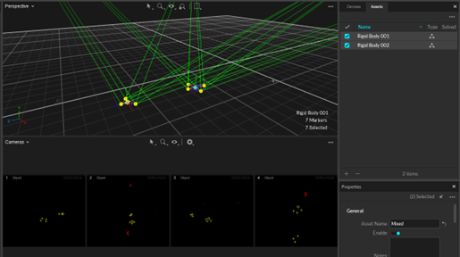
 <figcaption align = "center">Figure X: Observe both rigid body objects in Motive       </figcaption>
  </p>
</figure>

2. Turn on Motive Streaming – refer to Lab 1 for step-by-step instructions. 
<!--Picture 1-->
<figure align = "center">
  
 <figcaption align = "center">Figure X: Motive Broadcast Settings       </figcaption>
  </p>
</figure>

3. On Computer 1 in Simulink modify the FuncMotive function to transfer the additional variables of the multiple Rigid Bodies 

        a. NOTE: each Rigid Body will have 3 translation variables and either 3 angular rotation variables or 4 quaternion variables.  
<!--Picture 1-->
<figure align = "center">
  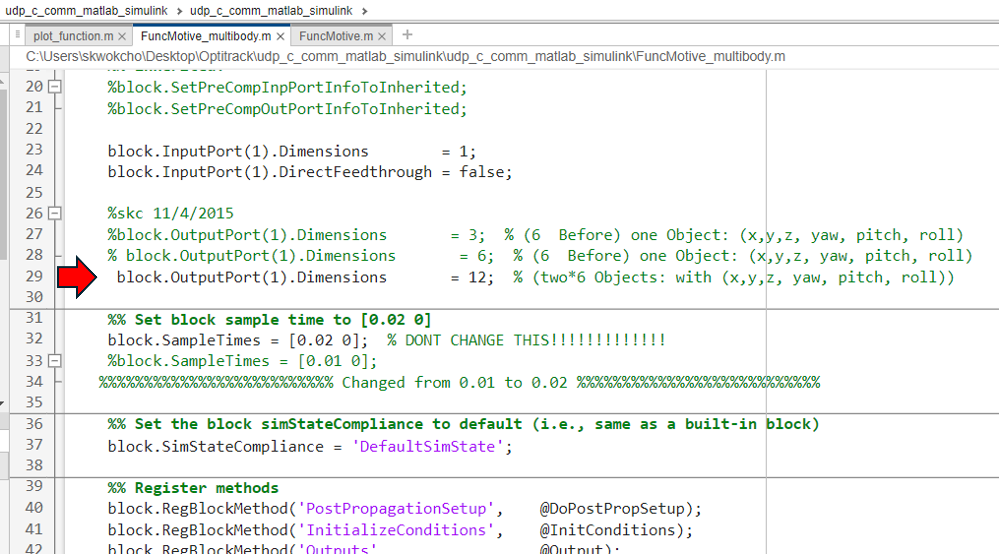
 <figcaption align = "center">Figure X: Figure X: FuncMotive-Setting up output dimensions (number of variables) to 12 (6 per Rigid Body).      </figcaption>
  </p>
</figure>
<!--Picture 2-->
<figure align = "center">
  
 <figcaption align = "center">Figure X: FuncMotive function edit to adjust the number of dimensions – adjustment to two rigid body objects that each have XYZ, Phi, Theta, Psi       </figcaption>
  </p>
</figure>
<!--Picture 3-->
<figure align = "center">
  
 <figcaption align = "center">Figure X: FuncMotive-Data values for second Rigid Body (Part 1) , Make sure to name and track each variable accordingly.       </figcaption>
  </p>
</figure>
<!--Picture 4-->
<figure align = "center">
  
 <figcaption align = "center">Figure X: FuncMotive-Data values for second Rigid Body (Part 2) Calculations for the Euler Angles.       </figcaption>
  </p>
</figure>

NOTE: Here is where you can get quaternions instead of euler angles. If you use quaternions, you will need 7 output values instead of 6 per Rigid Body 

4. On Computer 1 Modify the Simulink program to handle multiple Rigid Bodies.  

        a. Hint: Larger Muxs to handle the larger input 
<!--Picture 1-->
<figure align = "center">
  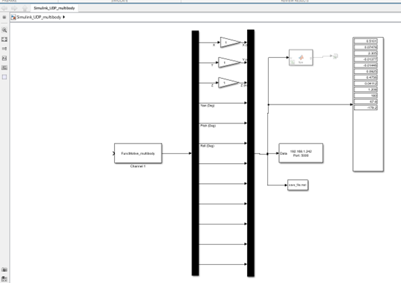
 <figcaption align = "center">Figure X: Simulink Config on Computer 1 – Twelve – 12 variables collected from the modified FuncMotive function       </figcaption>
  </p>
</figure>
<!--Picture 1-->
<figure align = "center">
  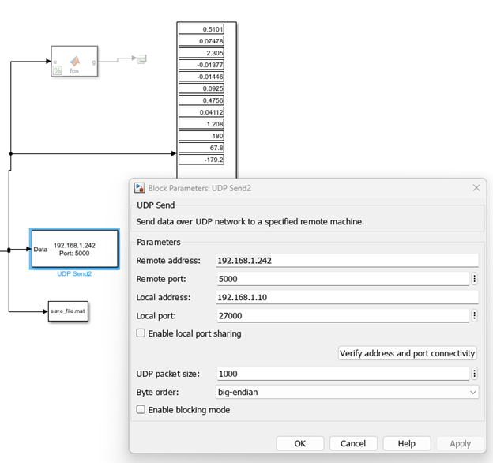
 <figcaption align = "center">Figure X: Settings are still the same on Computer 1       </figcaption>
  </p>
</figure>

5. On Computer 2 Modify the Simulink program to handle multiple Rigid Bodies. 

 
### 3.2 Tracking and Recording of a Multiple Rigid Body System through Motive and Matlab|Simulink 

1. Prepare two air-bearing vehicles for the experiment 
<!--Picture 1-->
<figure align = "center">
  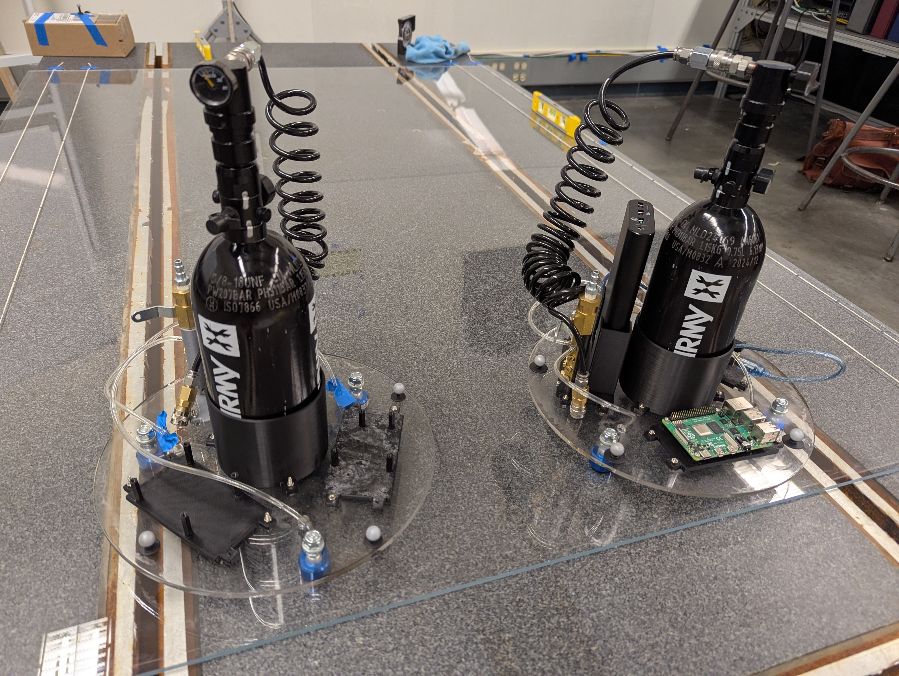
 <figcaption align = "center">Figure X: Two Air-Bearing Vehicles       </figcaption>
  </p>
</figure>

    a. Both on table 

    b. Both full of air 

    c. Both vehicles have Motive markers  

    d. Air turned off 

2. On Computer 1 set up Motive to track the 2 air-bearing vehicles 
<!--Picture 1-->
<figure align = "center">
  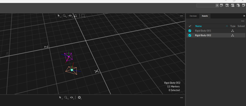
 <figcaption align = "center">Figure X: Two rigid bodies tracked in optitrack       </figcaption>
  </p>
</figure>

3. On Computer 1 make sure Motive has the appropriate broadcast settings (refer to Lab 1) 
<!--Picture 1-->
<figure align = "center">
  
 <figcaption align = "center">Figure X: Motive Broadcast Settings       </figcaption>
  </p>
</figure>

4. On Computer 1: (see earlier in this lab manual for step-by-step instructions) 

        a. change FuncMotive to track two rigid bodies. 

        b. On Computer 1 change Simulink to accept two rigid bodies.  

5. On Computer 2 make changes to Simulink to accept two rigid bodies. 

6. Set up two air-bearing vehicles 

7. Perform Experiment: Perform a translation experiment with both vehicles 

    a. Person 1: Activate Matlab|Simulink Data Streaming on Computer 1 

    b. Person 1: Turn on Air to both FSS vehicles and coordinate translation push countdown of both vehicles across the table. 

    c. Person 2: 5 seconds before experiment start recording data on student computer in Matlab|Simulink. 

    d. Person 1: gently push both vehicles from one side of the table. 

    e. Person 3: catch both vehicles and gently bring both vehicles to rest. 

    f. Person 2: Stop data recording. 

### 3.2.1. Example Graphs and Plots that students need to create: 
<!--Picture 1 and 2-->
  <p align="center">
    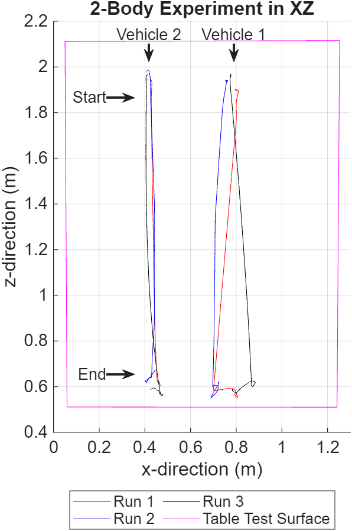
    &nbsp; &nbsp; &nbsp;
    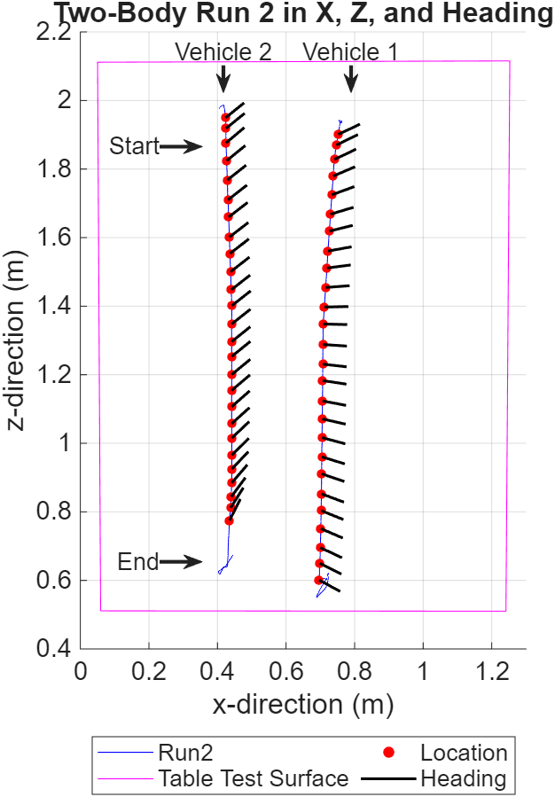
  </p>
  <p align = "center">
    <caption> Figure X: Path trajectories of three translation experiments.  </figcaption>
  </p>
<!--Picture 3-->
<figure align = "center">
  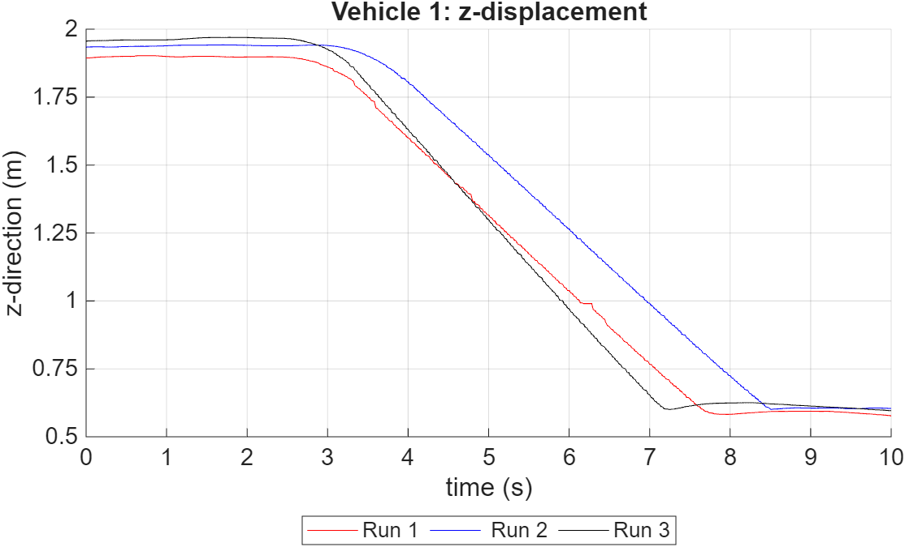
 <figcaption align = "center">Figure X: Z translation data vs. Time for Vehicle 1 across all three captured runs.       </figcaption>
  </p>
</figure>
<!--Picture 4-->
<figure align = "center">
  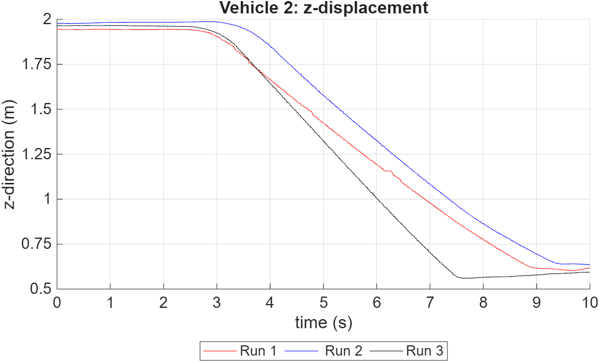
 <figcaption align = "center">Figure X: Z translation data vs. Time for Vehicle 2 across all three captured runs.         </figcaption>
  </p>
</figure>
<!--Picture 5-->
<figure align = "center">
  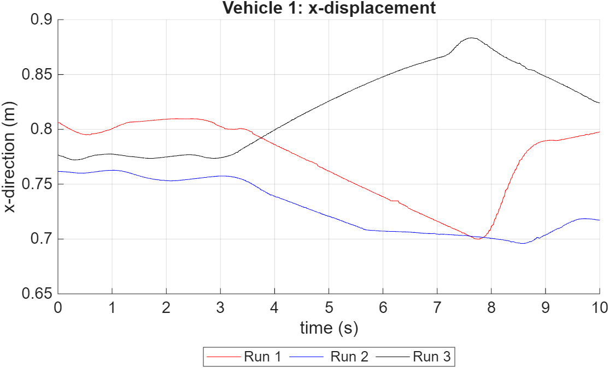
 <figcaption align = "center">Figure X: X translation data vs. Time for Vehicle 1 across all three captured runs.       </figcaption>
  </p>
</figure>
<!--Picture 6-->
<figure align = "center">
  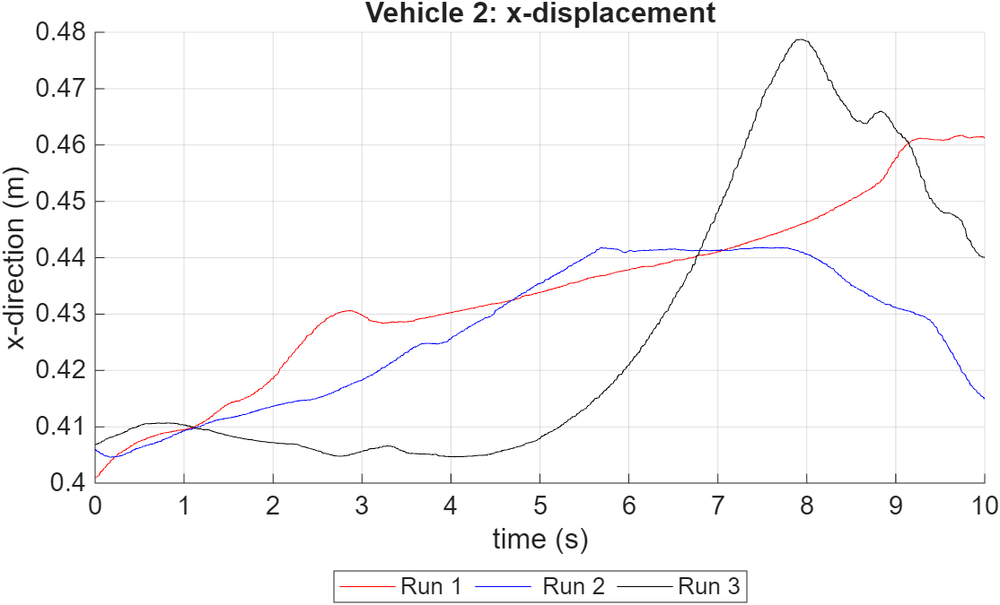
 <figcaption align = "center">Figure X: X translation data vs. Time for Vehicle 2 across all three captured runs.      </figcaption>
  </p>
</figure>
<!--Picture 7-->
<figure align = "center">
  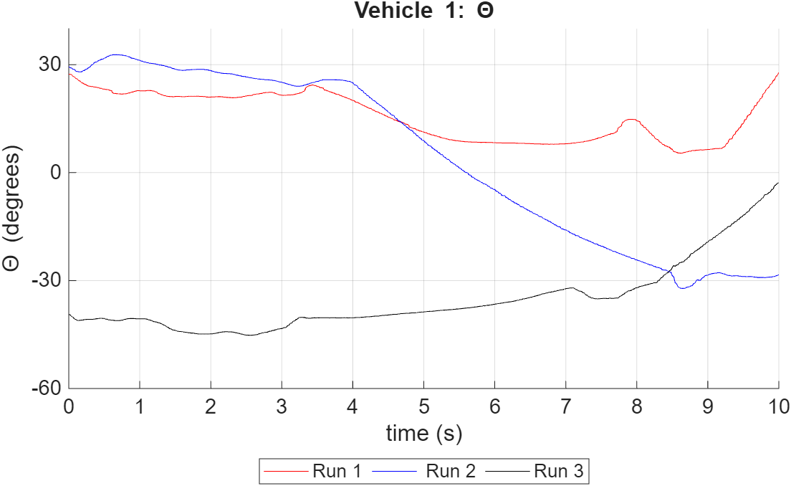
 <figcaption align = "center">Figure X: θ translation data vs. Time for Vehicle 1 across all three captured runs.      </figcaption>
  </p>
</figure>
<!--Picture 8-->
<figure align = "center">
  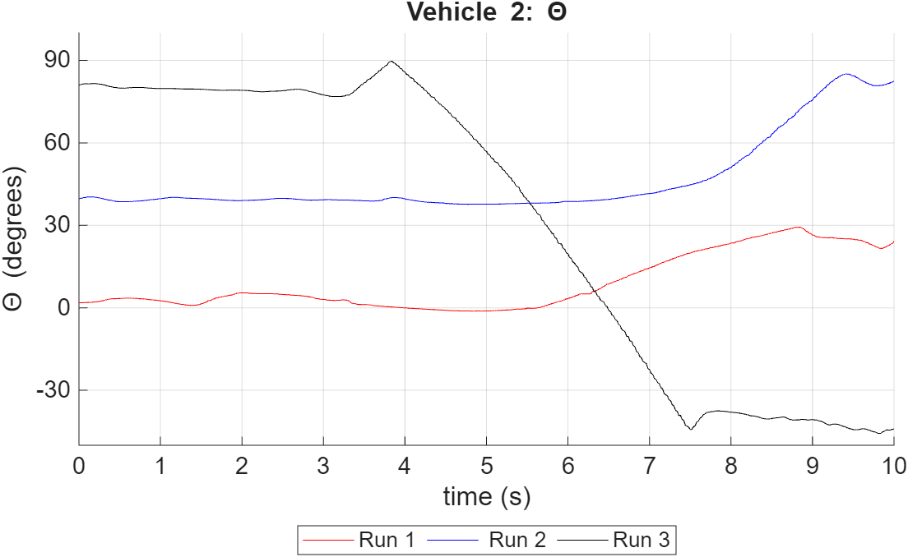
 <figcaption align = "center">Figure X: θ translation data vs. Time for Vehicle 2 across all three captured runs.
      </figcaption>
  </p>
</figure>